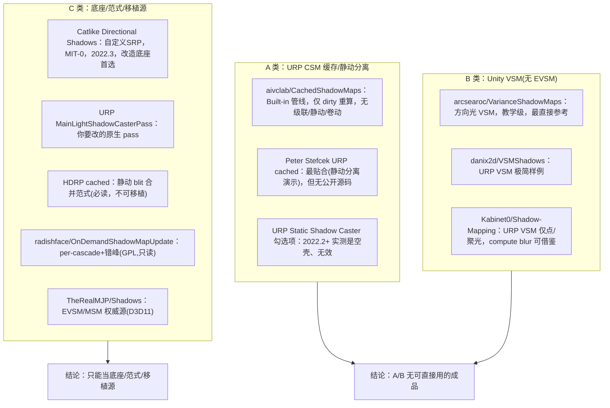
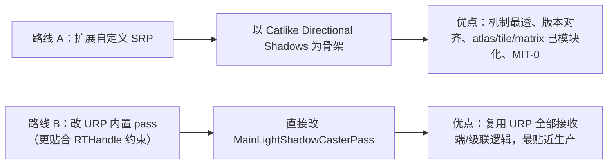
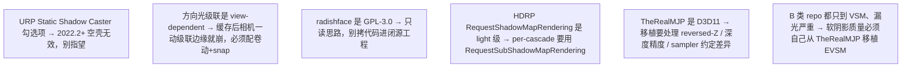
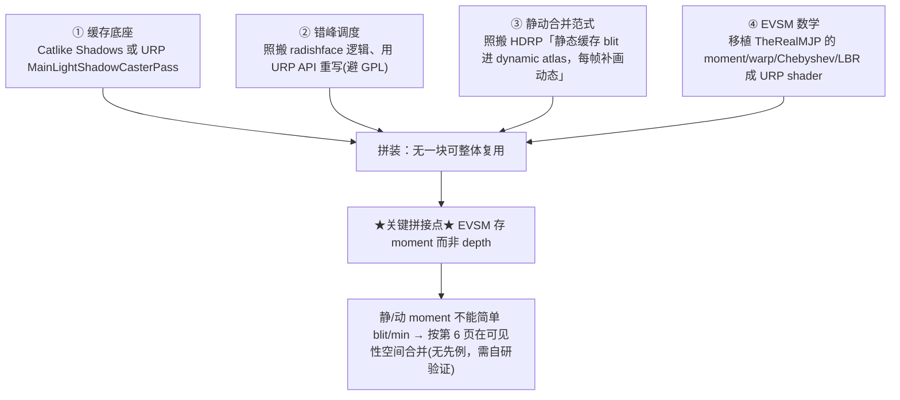

# 开源方案盘点与拼装路径

一句话结论：**URP14 上没有任何即插即用的 CSM 缓存或 EVSM 成品**，"EVSM + 缓存"组合在开源界**完全不存在**。最现实的路径是把四块分别成熟的东西拼起来自研。本页给出盘点、选型推荐与拼装路线，承接 [总览](1. 缓存式阴影优化总览：双支柱架构与核心难题.md) 的工程现实判断[^66]。

## 全景：四类方案的成熟度

## 选型推荐表

| 方案 | 维护 | URP14 兼容 | 覆盖技术点 | 定位 |
|---|---|---|---|---|
| aivclab/CachedShadowMaps | 停更 | ❌ Built-in | 仅 dirty 重算 | 仅参考(dirty 思路) |
| Peter Stefcek URP cached | 无源码 | — | 静动分离(演示) | 仅参考(可行性佐证) |
| arcsearoc/VarianceShadowMaps | 实验 | ⚠️ 需适配 | VSM 方向光 | **VSM 改造起点候选** |
| Kabinet0/Shadow-Mapping | 未完成 | ⚠️ punctual | VSM+compute blur | 仅参考(blur 思路) |
| HDRP cached(官方) | ✅ | ❌ HDRP | 级联缓存/静动 blit | **机制参考(必读)** |
| radishface/OnDemand | ✅ 2024 | ❌ HDRP/GPL | per-cascade+错峰 | **机制参考**(只读) |
| **Catlike Directional Shadows** | ✅ | ✅ 2022.3 | CSM/PCF/blend/bias 全套 | **改造底座(首选)** |
| cinight/CustomSRP | ✅ 646★ | ✅ | RTHandle/RenderPass 基建 | 基建参考 |
| **TheRealMJP/Shadows** | ✅ 2024 | ❌ D3D11 | EVSM/MSM 权威 | **EVSM 移植源(首选)** |
| **URP MainLightShadowCasterPass** | ✅ 官方 | ✅ | URP 原生 CSM | **改造对象** |

**两条底座路线（二选一）**[^66]：

## 避坑清单

## 拼装路径：四块自拼

具体三处改造（缓存底座）[^66]：① `GetTemporaryRT`（每帧释放）→ 持久 RTHandle（见 [第 2 页](2. 静动分离与 URP14 持久化缓存.md)）；② 引入稳定 tile 槽位 + per-light/per-cascade dirty 标记（见 [第 4 页](4. 更新调度：时间错峰与脏区失效.md)）；③ 加 scrolling（按级联 texel size 做 world-space snap，相机平移卷动而非全重画，见 [第 3 页](3. 稳定化：Texel Snapping 与卷动更新.md)）。EVSM moment 纹理用 **RGBA float32**（EVSM 必须 fp32），blur 可参考 Kabinet0 的 compute box blur。

> ⚠️ **整个组合里最需要自研验证的环节**：EVSM 的"静态缓存 moment"与"动态 moment"合并——**没有任何现成实现**，必须按 [第 6 页](6. 核心难题：静动 EVSM 的合并.md) 的可见性空间合并方案自己实现并实测。

> ⚠️ **Gap 提示**：多个小 repo 的精确 star/更新日期/Unity 版本未经 GitHub API 核实（本机无 `gh`，WebSearch 工具不可用，检索靠 WebFetch + DuckDuckGo HTML）；StressLevelZero/Custom-URP、Echoes of Somewhere 博客等线索未深挖[^66]。

[^66]: [[opensource-shadow-cache-evsm-survey|开源方案盘点：URP 阴影缓存 / VSM-EVSM]] — synthesis（含 Catlike Coding、TheRealMJP/Shadows、HDRP 文档、radishface、arcsearoc/danix2d/Kabinet0 等 15 来源，详见笔记）

## Sources

| # | Title | Raw Note | Original |
|---|-------|----------|----------|
| 3 | 开源方案盘点 | [[opensource-shadow-cache-evsm-survey]] | [Catlike Directional Shadows](https://catlikecoding.com/unity/tutorials/custom-srp/directional-shadows/) · [TheRealMJP/Shadows](https://github.com/TheRealMJP/Shadows) · [radishface/OnDemandShadowMapUpdate](https://github.com/radishface/OnDemandShadowMapUpdate) |
