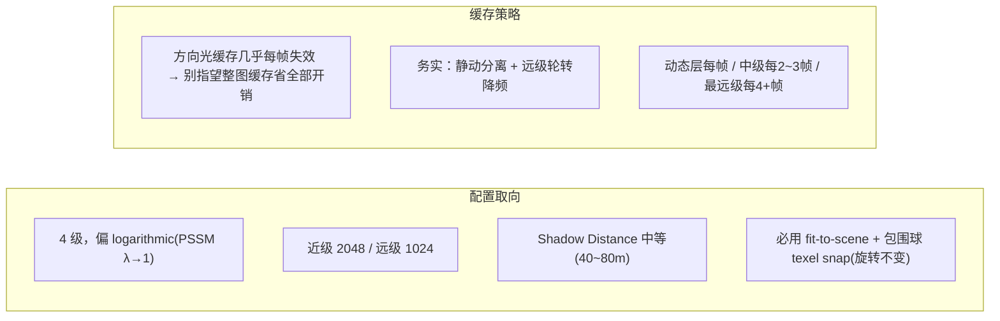
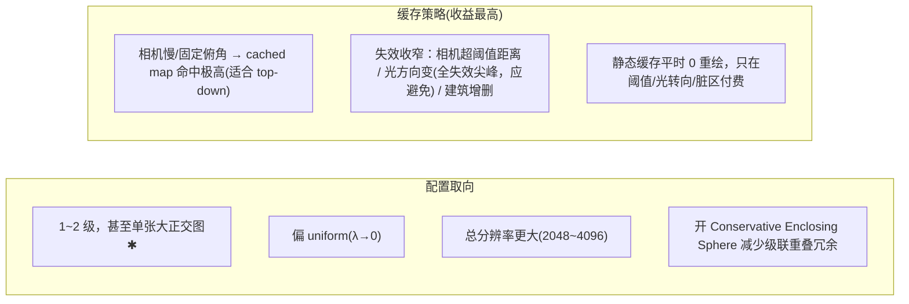
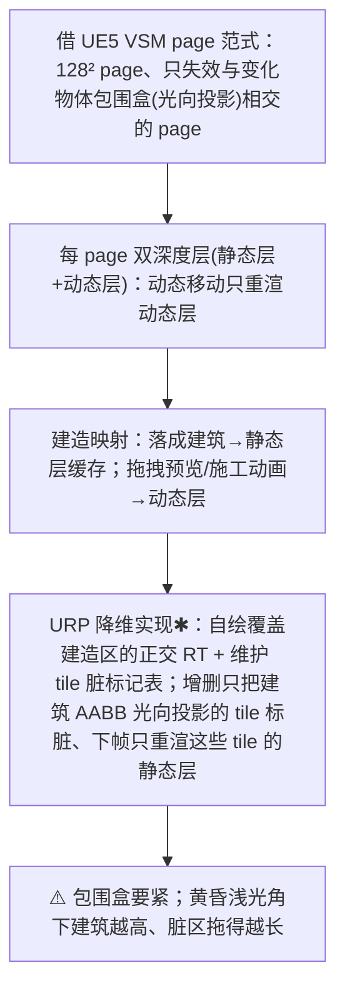
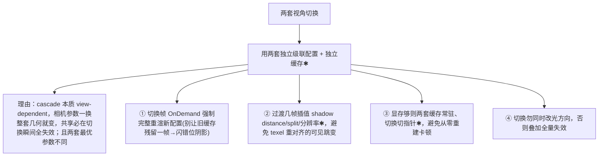

# 双视角调参：过肩 vs 2.5D 建造

同一套阴影系统要兼顾两套相机，而它们对缓存的压力**截然相反**：过肩相机平移+旋转持续打破对齐（高失效），2.5D 建造相机稳定/近正交（高命中）。本页给两套相机各自的 cascade 配置、缓存策略与失效条件，以及视角切换怎么处理。承接前面所有缓存机制页[^67]。

> URP14 内置阴影**不提供** cached/scrolling shadow，下面的缓存/失效策略需靠自定义 ScriptableRenderPass 落地（见 [第 7 页](7. 开源方案盘点与拼装路径.md)）；URP 原生只能调级联划分、分辨率、距离衰减、Conservative Enclosing Sphere。标 ✱ 者为工程推断[^67]。

## 为什么两套相机要分开调

两个机理前提[^67]：(1) 透视走样严重程度取决于相机 Z 动态范围与朝向（Microsoft：贴地相机 vs 俯视机位需要完全不同的级联划分，几何集中时级数更少）；(2) 缓存收益取决于光的正交投影是否逐帧稳定（shimmer 根因是相机动→投影变，要靠 [texel snap](3. 稳定化：Texel Snapping 与卷动更新.md) 稳定）。

## 过肩视角调参

本质"贴地大 Z 动态范围 + 高失效频率"的经典动作游戏场景。

要点[^67]：
- **划分**：PSSM practical split `λ·log + (1−λ)·uniform`，λ=0.5 起步、近景吃重往 1 调；URP 默认 split 0.1/0.25/0.5 是偏 log 的合理起点，过肩可把第一刀再压到 0.06~0.08 让贴身近景更密。
- **分辨率**：URP 按 tile 切同一 atlas，`texelSize = 2·cullingSphere.radius / tileSize`——压近 split = 提升近级有效分辨率。开 PCF + normal bias（URP normal bias 已按 texelSize×√2 缩放）。
- **缓存现实**：HDRP/社区一致——方向光缓存在 FPS/TPS 下几乎每帧重算、优化被抵消，XR/持续运动下"方向光缓存基本不可能"。过肩唯一可靠的缓存式省法是**静动分离 + 远级交错更新**（社区实测"60Hz 每周期更新一个 cascade、最远级更稀"在正常移动下完全稳定）。
- **必用 stable-fit**：过肩会旋转，fit-to-cascade 会让投影随朝向胀缩抖动 → 必须 fit-to-scene/包围球（[第 3 页](3. 稳定化：Texel Snapping 与卷动更新.md)）。URP14 内置无 "Stable Fit" 开关，自绘 pass 时务必自己实现。

## 2.5D 建造视角调参

本质"几何集中、Z 动态范围小、缓存命中天然极高、但有局部脏区"的 RTS/城建场景。

要点[^67]：
- **正交为何少级**：正交投影下视野内 texel 密度本就均匀，没有"近密远疏"的透视梯度，所以 Microsoft 说几何集中/俯视时 3 级甚至更少就够、Z 动态范围低几乎没有多级好处。极端固定俯角可退化为单张大正交图✱。URP 级联用球形 culling sphere，级数越多球间重叠浪费越大，对几何集中场景更不划算。
- **失效条件**：① 相机移动超阈值距离才更新；② **光方向变化会一次性失效全部缓存**（性能尖峰，应避免连续改方向，或只改颜色/强度）；③ 局部建筑增删 → 脏区失效。

### 2.5D 建造的脏区失效（核心）

详见 [第 4 页](4. 更新调度：时间错峰与脏区失效.md) 的脏区机制[^67]。

## 视角切换

要点[^67]：两套相机的 split/级数/分辨率/stable-fit 策略都不同（过肩 4 级 log/fit-to-scene；2.5D 1~2 级 uniform/单大图），共享一套必然两边都不优。HDRP 文档佐证 directional cascade 缓存"始终随视角变化"，官方建议方向光缓存配 OnDemand + 频繁 `RequestShadowMapRendering`——切换相机时正是要主动触发完整重渲。注意 HDRP mixed-cache 每帧 blit + 双 atlas 显存，维护两套缓存要把双倍显存算进预算。

> ⚠️ **Gap 提示**：具体城建游戏（Cities Skylines / Anno / 等距 RTS）的阴影方案未取到一手资料，"top-down 适合缓存"仅引社区共识与机理；"正交单张大图最优""多帧插值""两套常驻切指针""VSM page 降维成 URP tile 脏表"等为工程推断✱，落地需自测[^67]。

各视角配置如何排进落地顺序，见 [第 9 页](9. 实现路线图与决策清单.md)。

[^67]: [[dual-view-shadow-tuning|双视角阴影调参：过肩 vs 2.5D 建造]] — synthesis（含 Microsoft Cascaded Shadow Maps、PSSM GPU Gems 3 Ch.10、Catlike Directional Shadows、Unreal VSM、HDRP 文档、Unity Discussions 实测，详见笔记）

## Sources

| # | Title | Raw Note | Original |
|---|-------|----------|----------|
| 4 | 双视角阴影调参 | [[dual-view-shadow-tuning]] | [Microsoft Cascaded Shadow Maps](https://learn.microsoft.com/en-us/windows/win32/dxtecharts/cascaded-shadow-maps) · [PSSM (GPU Gems 3 Ch.10)](https://developer.nvidia.com/gpugems/gpugems3/part-ii-light-and-shadows/chapter-10-parallel-split-shadow-maps-programmable-gpus) · [Unreal VSM](https://dev.epicgames.com/documentation/en-us/unreal-engine/virtual-shadow-maps-in-unreal-engine) |
