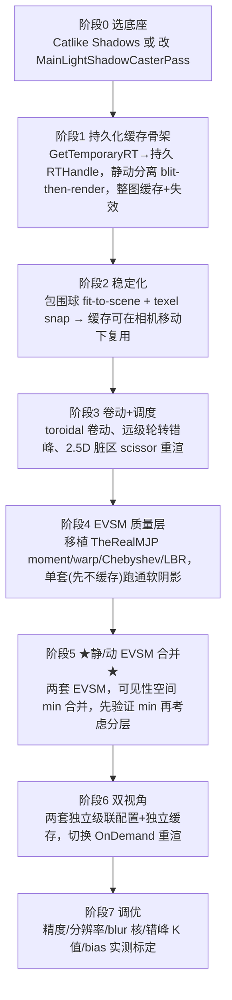
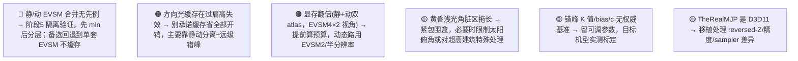

# 实现路线图与决策清单

把前八页综合成"从零到可用"的落地顺序。原则是**先把缓存跑通拿到性能，再叠 EVSM 拿质量，最后处理双视角与原创合并的验证**——风险最高、最无先例的环节（静/动 EVSM 合并）放在已有稳定底座之后，便于隔离问题。承接 [拼装路径](7. 开源方案盘点与拼装路径.md) 与 [核心难题](6. 核心难题：静动 EVSM 的合并.md)。

## 分阶段建造顺序



> 每个阶段都是**可独立验证的里程碑**：阶段 1-3 完成就能用标准深度图拿到"缓存性能收益"（哪怕还没软阴影）；阶段 4 单独验证 EVSM 软阴影质量；阶段 5 才把两者合并——这样阶段 5 出问题时，缓存和 EVSM 已各自验证过，便于定位。

## 关键决策树

```mermaid
flowchart TD
    D1{"底座路线？"}
    D1 -->|想复用 URP 全部接收端/级联逻辑、贴近生产| D1a["改 MainLightShadowCasterPass"]
    D1 -->|想要最透明可控、可大改| D1b["Catlike 自定义 SRP(MIT-0)"]

    D2{"EVSM2 还是 EVSM4？"}
    D2 -->|静态路(质量优先)| D2a["EVSM4 (4×fp32,128bit)"]
    D2 -->|动态路(可省)| D2b["EVSM2 (2×fp32,64bit) + 半分辨率"]

    D3{"静/动合并用 min 还是乘？"}
    D3 -->|默认/最常见'静态背景+动态角色'| D3a["min：保守、一前一后精确"]
    D3 -->|并排双半影明显偏亮| D3b["可试 Vs·Vd 或按深度分层(LVSM)"]

    D4{"两视角缓存？"}
    D4 -->|显存紧| D4a["切换时重建单套"]
    D4 -->|显存够| D4b["两套常驻、切指针✱"]
```

## 各视角推荐配置（起点，需实测标定）

| 维度 | 过肩第三人称 | 2.5D 建造 |
|---|---|---|
| Cascade 数 | 4 | 1~2（极端俯角可单张大图✱） |
| 分割 | 偏 log（λ→1），split≈0.06~0.08/0.25/0.5 | 偏 uniform（λ→0） |
| 分辨率 | 近 2048 / 远 1024 | 单图 2048~4096 |
| 拟合 | **必须** fit-to-scene + 包围球 | 固定俯角，snap 仍要做 |
| 缓存命中 | 低（几乎每帧失效） | **极高** |
| 缓存策略 | 静动分离 + 远级轮转(近1/中2~3/远4+帧) | 整图缓存 + 阈值/脏区失效 |
| 失效重点 | 相机平移旋转 | 建筑增删脏区 + 慎改光方向 |

## 性能/质量参数基线


详细出处与推导见 [第 5 页](5. Variance 与 EVSM 软阴影机理.md) 与 [第 6 页](6. 核心难题：静动 EVSM 的合并.md)[^65]。

## 风险登记（按风险从高到低）



| 风险 | 缓解 | 相关页 |
|---|---|---|
| 静/动 EVSM 合并无先例（最高） | 阶段化隔离；先验证 `min`；保留"单套 EVSM 不缓存"回退 | [第 6 页](6. 核心难题：静动 EVSM 的合并.md) |
| 过肩方向光缓存高失效 | 静动分离 + 远级错峰，不指望整图缓存 | [第 4 页](4. 更新调度：时间错峰与脏区失效.md)、[第 8 页](8. 双视角调参：过肩 vs 2.5D 建造.md) |
| 显存翻倍 | 动态路 EVSM2 + 半分辨率；评估两套缓存是否都常驻 | [第 6 页](6. 核心难题：静动 EVSM 的合并.md) |
| 浅光角脏区拖长 | 紧包围盒 + 限制太阳俯角✱ | [第 4 页](4. 更新调度：时间错峰与脏区失效.md) |

## 一句话总纲

> **缓存（Catlike/URP-pass + 持久 RTHandle + 卷动/snap + 错峰/脏区）拿性能 → EVSM（移植 TheRealMJP + fp32）拿软阴影质量 → 两者在「可见性空间 min 合并」处自研验证 → 双视角各配一套独立级联与缓存。** 全程没有现成轮子，但每一块都有成熟参考，唯独「静/动 EVSM 合并」是原创、必须实测。

[^65]: [[variance-evsm-and-static-dynamic-merge|Variance/EVSM 机理与静动 moment 合并]] — synthesis（详见笔记）

## Sources

| # | Title | Raw Note | Original |
|---|-------|----------|----------|
| 2 | Variance/EVSM 机理与静动合并 | [[variance-evsm-and-static-dynamic-merge]] | [TheRealMJP/Shadows](https://github.com/TheRealMJP/Shadows) |
| 3 | 开源方案盘点 | [[opensource-shadow-cache-evsm-survey]] | [Catlike Directional Shadows](https://catlikecoding.com/unity/tutorials/custom-srp/directional-shadows/) |
