# NubisCloud 调试 / 平台 / 降级 / 材质函数 / 对比

> 依赖前置（不重复）：raw#1 平台硬编码开关，raw#3/4 空壳 cvar 名单，raw#5 Visualize 剩余 5 模式。
> 本笔记补齐 **cvar 全表 + 平台实装矩阵 + 降级决策树 + 资产踩点 + 与 UE 原生对比**。

---

## 1. E1 — cvar 清单大表（实际读自 NubisVolumes.cpp 全文）

*空壳*的判定方式：cvar 定义后 namespace getter 暴露，但 `LiveShadingPipeline.cpp` / shader permutation / shader .ush 里 0 处消费；或代码被 `[CL611225 调试RT]` 整块注释掉。

| # | cvar 名 | 默认 | 类型 | 位置 | 作用面 | 实装 | 备注 |
|---|---|---|---|---|---|---|---|
| 1 | `r.NubisVolumes` | 1 | int | NV.cpp:20 | 总开关 | ✅ 实装 | 0 → 整条管线短路（IsNubisVolumesEnabled → ShouldRenderNubisVolumes） |
| 2 | `r.NubisVolumes.Debug` | 0 | int | NV.cpp:27-32 整块注释 | Debug RT 输出 | ❌ 已删除 | CL611225 回滚 |
| 3 | `r.NubisVolumes.HardwareRayTracing` | 0 | int | NV.cpp:34 | HWRT 加速 | ⚠️ 空壳 | `UseHardwareRayTracing()` 保留但 raw#3/4 已证 LiveShadingPipeline 0 消费 |
| 4 | `r.NubisVolumes.IndirectLighting` | 0 | int | NV.cpp:41 | 间接光 | ⚠️ 空壳 | `UseIndirectLighting()` getter 存在，下游未消费 |
| 5 | `r.NubisVolumes.Jitter` | 1 | int | NV.cpp:48 | 射线步进抖动 | ✅ 实装 | `ShouldJitter()` → Bayer 子像素偏移 |
| 6 | `r.NubisVolumes.MaxStepCount` | 256 | int | NV.cpp:55 | 最大步进数 | ✅ 实装 | 已降低 (512→256) |
| 7 | `r.NubisVolumes.MaxTraceDistance` | 1 500 000cm (=15km) | float | NV.cpp:63 | 最大 trace 距离 | ✅ 实装 | |
| 8 | `r.NubisVolumes.MaxShadowTraceDistance` | 300 000cm (=3km) | float | NV.cpp:70 | 阴影 trace 距离 | ✅ 实装 | |
| 9 | `r.NubisVolumes.NearCloudDownsampleFactor` | 4 | int | NV.cpp:77 | Near pipe 降采样 | ✅ 实装 | 只接受 2 或 4, 代码 `(Value>=3)?4:2` 钳位 (NV.cpp:443) |
| 10 | `r.NubisVolumes.Preshading` | 0 | int | NV.cpp:87 | 预烘焙体素 | ⚠️ 空壳 | 仅 namespace 侧保留，LiveShadingPipeline 走 OnDemand 路径 |
| 11 | `r.NubisVolumes.Preshading.MipLevel` | 0 | int | NV.cpp:94 | 预烘焙 MIP | ⚠️ 空壳 | 配合 #10 |
| 12 | `r.NubisVolumes.VolumeResolution.X` | 0 | int | NV.cpp:101 | 预烘焙体素 X | ⚠️ 空壳 | 0=使用 per-volume |
| 13 | `r.NubisVolumes.VolumeResolution.Y` | 0 | int | NV.cpp:110 | 预烘焙体素 Y | ⚠️ 空壳 | |
| 14 | `r.NubisVolumes.VolumeResolution.Z` | 0 | int | NV.cpp:119 | 预烘焙体素 Z | ⚠️ 空壳 | |
| 15 | `r.NubisVolumes.MinStepSize` | 1.0m | float | NV.cpp:128 | 自适应步长下限 | ✅ 实装 | |
| 16 | `r.NubisVolumes.StepCoefficient` | 0.15 | float | NV.cpp:136 | 自适应步长系数 | ✅ 实装 | `step = max(Min, sqrt(d)*Coeff*StepFactor)` |
| 17 | `r.NubisVolumes.ShadowStepSize` | -1.0 (禁用) | float | NV.cpp:145 | 阴影步长覆写 | ✅ 实装 | 负值 → 走默认自适应 |
| 18 | `r.NubisVolumes.MipRingEarlyExit` | 0 (OFF) | int | NV.cpp:155 | Mip 环带 early-exit | ✅ 实装 | 开启可能漏厚云，保持默认 OFF |
| 19 | `r.NubisVolumes.MipRingCrossoverCm` | 500 cm | float | NV.cpp:166 | Mip 环带重叠宽度 | ✅ 实装 | 见 raw#2 |
| 20 | `r.NubisVolumes.NearDominanceBlend` | 1 | int | NV.cpp:177 | Soft Near Dominance | ✅ 实装 | Bilateral Upscale 内 smoothstep 压制 Far |
| 21 | `r.NubisVolumes.NearDominanceStartAlpha` | 0.3 | float | NV.cpp:186 | 起始 alpha 阈值 | ✅ 实装 | |
| 22 | `r.NubisVolumes.NearDominanceEndAlpha` | 0.6 | float | NV.cpp:194 | 结束 alpha 阈值 | ✅ 实装 | |
| 23 | `r.NubisVolumes.SparseVoxel` | 0 | int | NV.cpp:202 | Sparse Voxel 开关 | ⚠️ 空壳 | raw#3/4 已证 Pipeline 0 使用 |
| 24 | `r.NubisVolumes.SparseVoxel.GenerationMipBias` | 3 | int | NV.cpp:209 | SV MIP bias | ⚠️ 空壳 | |
| 25 | `r.NubisVolumes.SparseVoxel.PerTileCulling` | 1 | int | NV.cpp:216 | SV 瓦片剔除 | ⚠️ 空壳 | |
| 26 | `r.NubisVolumes.SparseVoxel.Refinement` | 1 | int | NV.cpp:223 | SV 层级精炼 | ⚠️ 空壳 | |
| 27 | `r.NubisVolumes.LightingCache` | 1 | int | NV.cpp:230 | LC 模式 (0 关/1 仅透射/2 含散射) | ✅ 实装 | `UseLightingCacheForInscattering()==2` / `UseLightingCacheForTransmittance()==1` |
| 28 | `r.NubisVolumes.LightingCache.DownsampleFactor` | 16 | int | NV.cpp:240 | LC 降采样倍率 | ✅ 实装 | 相对 preshading 体素分辨率 |
| 29 | `r.NubisVolumes.ReconstructRTDownsampleFactor` | 2 | int | NV.cpp:249 | Reconstruct RT 降采样 | ✅ 实装 | raw#6 管线用到 |
| 30 | `r.NubisVolumes.NubisFarTracingRTDownsampleFactor` | 2 | int | NV.cpp:256 | Far Tracing RT 降采样 | ✅ 实装 | 注释说 Default=4, 实际默认 2 |
| 31 | `r.NubisVolumes.NubisFrameAmortize` | 1 (BigRock) | int | NV.cpp:262 | 帧摊还模式 | ✅ 实装 | 1=BigRock, 2=horizon |
| 32 | `r.NubisVolumes.DepthSort` | 1 | int | NV.cpp:268 | 体积按质心深度排序 | ✅ 实装 | |
| 33 | `r.NubisVolumes.DitherFrameCount` | 4 | int | NV.cpp:275 | Bayer 抖动帧数 | ✅ 实装 | *必须* = DownsampleFactor² |
| 34 | `r.NubisVolumes.DitherBlendFactor` | 0.5 | float | NV.cpp:288 | 历史帧融合权重 | ✅ 实装 | |
| 35 | `r.NubisVolumes.FullResReconstruct` | 0 | int | NV.cpp:297 | 全分辨率 Reconstruct | ✅ 实装 | 1 启用新模式 |
| 36 | `r.NubisVolumes.FullResDitherFrameCountMultiplier` | 4 | int | NV.cpp:308 | 全分辨率模式帧数倍率 | ✅ 实装 | 与 #35 联动 |
| 37 | `r.NubisVolumes.DebugMipMask` | 0x3F (=63=全 6 级) | int | NV.cpp:322 | Mip 级位掩码 | ✅ 实装 | bit0..bit5 → Level 0..5 |
| 38 | `r.Nubis.LightingCache.ReseedFromParent` | 1 | int | NV.cpp:891 | Sector roll-in 从父级 reseed | ✅ 实装 | Clipmap 环滚 |
| 39 | `r.Nubis.Visualize.ClipmapLevel` | 0 | int | NV.cpp:1566 | 可视化 LC 的 Clipmap Level | ✅ 实装 | 0=近, N-1=远 |
| 40 | `r.Nubis.Visualize.LightingCacheSlice` | 0 | int | NV.cpp:1573 | LC 3D 的 Z 切片 | ✅ 实装 | |
| 41 | `r.Nubis.Visualize.LightingCacheTiled` | 0 | int | NV.cpp:1580 | Tiled/单切片切换 | ✅ 实装 | 1=栅格显示全部 slice |
| 42 | `r.Nubis.Visualize.DepthScale` | 1e-5 | float | NV.cpp:1587 | 深度可视化比例 | ✅ 实装 | |

> 计数：**42 条**（含 1 条完全删除 + 12 条空壳 = **约 29 条真实装**）。
> 另外 raw#6 已列 3 条 Reconstruct/Resolve cvar 在 `LiveShadingPipeline.cpp:18-50` 被整块注释，不计入本表。

---

## 2. E1 — Visualize 模式枚举表（CL611225 后剩余）

从 `NubisVolumesVisualize.usf:10-14` + `NubisVolumes.cpp:1594-1806` 实测，与 raw#5 的 "5 个" 吻合。

| `VisualizationMode` 值 | USF 宏 | 含义 | 绑定纹理 | 后处理 | 相关 cvar |
|---|---|---|---|---|---|
| 1 | `NUBIS_VIS_MODE_RADIANCE` | 体积 premultiplied-alpha scatter 直出 | `RadianceTexture` (2D) | Reinhard `rgb/(1+rgb)` | — |
| 2 | `NUBIS_VIS_MODE_DEPTH` | 云深度 Turbo colormap | `DepthTexture` (2D) | `saturate(r*DepthScale)` | `r.Nubis.Visualize.DepthScale` |
| 3 | `NUBIS_VIS_MODE_LIGHTING_CACHE` | LightingCache 3D 可视化（单 slice 或 tiled） | `LightingCacheTexture` (3D) | Heat colormap | `ClipmapLevel` / `LightingCacheSlice` / `LightingCacheTiled` |
| 4 | `NUBIS_VIS_MODE_FAR_TRACING` | Far-field dither trace 输出 | `FarTracingTexture` (2D) | Reinhard | — |
| 5 | `NUBIS_VIS_MODE_RECONSTRUCT` | 时序 Reconstruct 结果 | `ReconstructTexture` (2D) | Reinhard | — |
| default | — | 未知模式 → 品红色告警 | — | 硬编码 magenta | — |

激活路径（NV.cpp:1645-1660）：
1. `WITH_DEBUG_VIEW_MODES` 下 `EngineShowFlags.VisualizeNubis`；
2. 非 Editor 构建用 `FNubisVisualizationData::Update(NAME_None)` 读 cvar 触发（Standalone / Test / Development 均可用）。
3. `FNubisVisualizationData` / `NubisVisualizationData.h` 在本仓库 Grep 未命中（头文件被 `[CL611225 调试RT]` 注释掉了 include），但 `GetNubisVisualizationData()` 仍被引用 — [推测] 原定义保留在 Engine/Renderer/Public 其他 CL 里或 Engine/Plugins 侧，当前 cpp 直接链接。

---

## 3. E2 — 平台支持矩阵表

核心判定：`DoesPlatformSupportNubisVolumes`（NV.cpp:359-365）

```cpp
bool DoesPlatformSupportNubisVolumes(EShaderPlatform Platform)
{
    return IsFeatureLevelSupported(Platform, ERHIFeatureLevel::SM5)
        // && FDataDrivenShaderPlatformInfo::GetSupportsNubisVolumes(Platform)  // TODO
        && !IsForwardShadingEnabled(Platform);
}
```

加上 raw#1 的 `HIGAME_ENABLE_NUBIS` 硬编码，得到平台矩阵：

| 平台 (EShaderPlatform / 习惯命名) | `HIGAME_ENABLE_NUBIS` | SM5+ 达标? | Deferred? | NubisVolumes 渲染 | HWRT cvar 可用? | NubisCustom 编辑器插件 | 备注 |
|---|---|---|---|---|---|---|---|
| Win64 D3D11 (SM5) | 1 | ✓ | ✓ | ✅ | ⚠️ 空壳 | ✅ | 主力开发平台 |
| Win64 D3D12 (SM5/SM6) | 1 | ✓ | ✓ | ✅ | ⚠️ 空壳 | ✅ | PC 客户端目标 |
| Win64 Vulkan | 1 | ✓ | ✓ | ✅ | ⚠️ 空壳 | ✅ | 代码层无特殊分支 |
| PS5 (SP_PS5) | 1 | ✓ | ✓ | ✅ | ⚠️ 空壳 | ✅ | 代码未 `#if PS5` 屏蔽；Pb4ueRpc/AkAudio 层 raw#1 有 PS5 差异，Nubis 本体共用代码 |
| Android Vulkan (Mobile) | 1 (HIGAME_ENABLE_NUBIS 不受平台阻断) | ⚠️ 通常 ES3.1 | ❌ Forward | ❌ `DoesPlatformSupport` 返回 false | N/A | ⚠️ raw#1 未提及 Android deny list | 实际无法渲染 |
| Android Vulkan (SM5 高端) | 1 | ✓ | ⚠️ 多数工程默认 Forward | ❌ IsForwardShadingEnabled | N/A | — | 强制 Deferred 后理论可渲染（未验证）|
| Linux Server (HiGameServer) | 1? (未剔除 macro) | N/A (服务端无 Renderer) | N/A | N/A | N/A | ❌ NubisCustom 四模块 `PlatformDenyList=[Linux]` (raw#1) | 服务端不渲染，仅禁止编辑器扩展 |
| Switch / XSX | [推测] | — | — | [推测] 同 Deferred SM5 判断 | N/A | — | Grep 无任何 Switch/XSX/XBOX 分支 — 无特殊处理 |
| Editor Win64 | 1 | ✓ | ✓ | ✅ | ⚠️ 空壳 | ✅ Editor 独占 | NubisCustom 四插件 Win64 编辑器可用 |

关键负面实锤：
- `!IsForwardShadingEnabled(Platform)` — ES3.1 / Forward mobile → 直接 false。
- `TODO` 行标记 `FDataDrivenShaderPlatformInfo::GetSupportsNubisVolumes(Platform)` 尚未接入 DataDriven 白名单 → 目前是**开放式**判定，只要平台 SM5+Deferred 就放行，无精细白名单。
- `IsRayTracingEnabled()` 对 HWRT 起关门作用，但下游 0 消费，实际 PS5/D3D11 全部等同于关闭。

---

## 4. E2 — 降级路径决策树（Mermaid）

```mermaid
graph TD
  A["GPU 帧时长超预算<br/>目标: &lt; 2ms NubisPass"] --> B{哪一段慢?}

  B -->|"LightingCache 生成慢"| C["↓ LC DownsampleFactor<br/>16 → 32<br/>代价: LC 体素粗, 接缝风险"]
  B -->|"LightingCache 生成慢"| C2["↓ LightingCache 模式<br/>2 (含散射) → 1 (仅透射)<br/>代价: 散射信息丢失, 重算"]
  B -->|"LightingCache 生成慢"| C3["开启 ReseedFromParent=1<br/>(默认已开)<br/>减少 roll-in 重算"]

  B -->|"Near 管线慢"| D["↑ NearCloudDownsampleFactor<br/>2 → 4 (1/16 像素)<br/>代价: Bayer pattern 明显"]
  B -->|"Near 管线慢"| D2["Soft Near Dominance<br/>提高 StartAlpha/EndAlpha<br/>减少 Far 合成开销"]

  B -->|"Far 管线慢"| E["↑ FarTracingRTDownsampleFactor<br/>2 → 4<br/>代价: 远景云像素化"]
  B -->|"Far 管线慢"| E2["关闭 FarDither 策略<br/>bUseDither = false<br/>代价: 远云采样噪声"]
  B -->|"Far 管线慢"| E3["↓ MaxTraceDistance<br/>15km → 10km<br/>代价: 最远景云消失"]

  B -->|"Mip 总数过多"| F["DebugMipMask 位掩码<br/>0x3F → 0x0F<br/>只渲染 Level 0-3"]
  B -->|"Mip 总数过多"| F2["开启 MipRingEarlyExit<br/>⚠️ 默认 OFF<br/>可能漏厚云, 仅测试用"]

  B -->|"Ray 步进慢"| G["↓ MaxStepCount<br/>256 → 128"]
  B -->|"Ray 步进慢"| G2["↑ MinStepSize<br/>1m → 2m"]
  B -->|"Ray 步进慢"| G3["↑ StepCoefficient<br/>0.15 → 0.25"]

  B -->|"Reconstruct 带宽"| H["↑ ReconstructRTDownsampleFactor<br/>2 → 4"]
  B -->|"Reconstruct 带宽"| H2["关 FullResReconstruct<br/>FullResReconstruct=0"]

  B -->|"全局紧急"| Z["r.NubisVolumes = 0<br/>彻底关闭"]
```



注意事项：
- 禁用策略不正交，例如 NearDownsampleFactor 必须保持 `DitherFrameCount == Factor²` 才能让 Bayer 完整覆盖子像素（NV.cpp:279-287 注释明示）。
- Sparse Voxel / HWRT / IndirectLighting / Preshading 空壳系列**不可作为降级手段**。
- MipRingEarlyExit 默认 OFF 是**安全默认**，非优化出口。

---

## 5. D1 — MaterialFunction 资产清单

### 5.1 Content/Material/MaterialFunction/Nubis/

| 资产 | 推断用途 | 推断引用方 |
|---|---|---|
| `MF_NubisGetFractionFromValue.uasset` | 数值→0..1 归一化 | NoiseErosion / DensityRemap 内部用 |
| `MF_NubisGetUprezzedVoxelCloudDensity.uasset` | 体素密度上采样（低分 clipmap 体素 → 采样点 density） | Master Material M_NubisCloud |
| `MF_NubisGetVoxelCloudDensitySamples.uasset` | 多点 density 采样（可能用于梯度/法线） | M_NubisCloud, 光照评估 |
| `MF_NubisGetVoxelCloudMipLevel.uasset` | 根据世界位置选 clipmap MIP | Clipmap LOD 选择（与 raw#3/4 MipSelector 对应） |
| `MF_NubisValueErosion.uasset` | 密度侵蚀 (detail noise 砍边缘) | M_NubisCloud |
| `MF_NubisVolumeFloat2ValueRemap.uasset` | float2 范围重映射 | 通用工具 |
| `MF_NubisVolumeFloat3ValueRemap.uasset` | float3 范围重映射 | 通用工具 |
| `MF_NubisVolumeFloat4ValueRemap.uasset` | float4 范围重映射 | 通用工具 |
| `MF_NubisVolumeScalarValueRemap.uasset` | scalar 范围重映射 | 通用工具 |

*总计 9 个 MF.* 命名风格为 Guerrilla Games Nubis 论文同宗术语 (Value Erosion, Uprezz, Mip Level)，属"Nubis 通用材质函数层"。

### 5.2 Content/Material/Volumetric/Nubis/（Master 材质与实例）

| 资产 | 类型推断 | 用途 |
|---|---|---|
| `M_NubisCloud.uasset` | Master Material (MD_Volume + bIsUsedWithNubisVolumes) | Nubis 云渲染主材质，被 `DoesMaterialShaderSupportNubisVolumes` 判定使用 |
| `M_NubisCloud_Inst.uasset` | MaterialInstance | 参数化实例，供场景 NubisVolume 引用 |
| `M_NubisCloud_Interactive.uasset` | Master Material 变体 | 可交互云（raw#8 覆盖到的 InteractiveVolume 体系），猜测与角色冲击/风干涉有关 |
| `M_NubisCloud_Interactive_Inst.uasset` | MaterialInstance | Interactive 的 MI |

> 约束（见 NV.cpp:367-377）：材质域必须是 `MD_Volume`，且 `bIsUsedWithNubisVolumes` flag 为 true。上述 Master 材质一定勾选此 flag，否则 `DoesMaterialShaderSupportNubisVolumes` 返回 false → 全部 Mesh 被 `ShouldRenderMeshBatchWithNubisVolumes` 丢弃。

---

## 6. D2 — wenxiangzuo 测试样例踩点

TA wenxiangzuo 在 `Content/Developers/wenxiangzuo/` 下建了 9 个二级目录，其中 Nubis 相关三个：

| 样例 | 关键资产（实际落盘） | 演示场景 | 调试切入点 |
|---|---|---|---|
| **TestNubisLight** | `TestNubisLightMap.umap` + `NubisQuickCloud/NubisClipmapData_NubisZone2.uasset` + `NubisQuickCloud/Sectors/Mip0..N_Sector_[xyz]_{Modeling,SDF}.uasset` + `NubisVDBCache/NubisVDBCache_Config.uasset` + `NubisVDBCache/Voxel0..3/` | 灯光投射到 Nubis 云的测试场景；Clipmap 数据独立命名 `NubisZone2` | 开 `r.Nubis.Visualize.LightingCacheSlice` + `r.Nubis.Visualize.ClipmapLevel` 观察每级 LC 对光源响应 |
| **TestNubisPlane** | `TestNubisPlaneMap.umap` + `NubisQuickCloud/NubisModelingDataBP_NubisZone_C_0.uasset` + `NubisQuickCloud/NubisSDFDataBP_NubisZone_C_0.uasset` + `NubisVDBCache/Voxel1/` + `_GENERATED/wenxiangzuo/` | 平面化云 (薄层)，用于测试 Mip 0 近距离采样 | 开 `r.Nubis.Visualize.ClipmapLevel=0` + 配合 `DebugMipMask=0x01` 只看 Level 0 |
| **CustomNubisVolume** | `TestNubisVolume.umap`, `BP_TestBounds.uasset`, `ParkouringCloud.uasset` (8 MB, 可能是大 Asset), `TestGridColor.uasset`, `NubisCloud/NubisModelingDataBP_NubisZone_C_{2..5}.uasset` + `NubisSDFDataBP_NubisZone_C_{2..5}.uasset` (4 个 Zone 实例), `DebugQuickCloud/DebugNVDBData.uasset` + `DebugSDFData.uasset` + `M_TestNvdb.uasset` + `M_TestNvdb_Inst.uasset`, `VDBs/Altocumulus.uasset` + `Altocumulus_20.uasset` + `cirrostratus.uasset`, `TestMesh/TestNvdb_v6_03.uasset` | 自定义云形调试（raw#8 已详述）；含 **Parkouring 云**（角色穿云交互）、**Debug NVDB** 对比测试、**三种真实云类型** VDB (积云/高积云/卷层云) | 与 `r.NubisVolumes.NubisFrameAmortize` / `r.NubisVolumes.FullResReconstruct` 交叉切换看 Reconstruct 差异；`BP_TestBounds` 给 AABB 可视化 |

观察：
- `Sectors/Mip{0..N}_Sector_[x]_[y]_[z]_{Modeling|SDF}.uasset` 命名完全对齐 raw#2 Clipmap sector 滚动设计。
- `NubisVDBCache/Voxel0..3/` 数字后缀 = MIP Level（raw#2 推断），每级独立一组 `NubisHiCloud2Actor*` 资产。
- 三套 TestMap 是互相**独立**的调试入口，不是一个大场景（便于隔离 bug）。

---

## 7. E3 — 与 UE 默认 VolumetricCloud / VolumetricFog 对比

| 维度 | UE 原生 VolumetricCloud | UE 原生 VolumetricFog | HiGame NubisCloud |
|---|---|---|---|
| 数据源 | NoiseTexture + WorldPosition 过程化 | Particle 喷射 + GlobalDensity | **Houdini OpenVDB 烘焙 → NVDB Asset → Clipmap sector** (raw#2) |
| 空间组织 | 全世界单层（Start/Top Layer Height） | 视锥对齐的 3D Froxel (通常 240×136×64) | **Clipmap 6 Level + Sector 分块** (raw#3/4) |
| 调度 | 单 Pass 全屏 ray marching | Compute Shader 写入 3D RT | **Two-Pass**: LC 生成 → 散射渲染 (raw#6) |
| 分辨率策略 | TAA + Temporal Upsample | Froxel 时序重投影 | **Bayer dither + DitherFrameCount=N² + Bilateral Upscale** (raw#8, #9 此表 #33) |
| 时间复用 | TAA 历史帧单值 | 上一帧 Froxel 重投影 | **LightingCache EMA β=0.97** + **Reproject** + **ReseedFromParent** (raw#2/6) |
| 光照 | Bruneton SkyAtmosphere + 定向光 | 点光/聚光注入 | 定向光 + VolumetricFog 阴影注入（NVP.cpp:1265 `GetShadowForInjectionIntoVolumetricFog`）+ VSM 阴影 |
| 跨平台白名单 | DataDriven 精细 + SM5 | Deferred+SM5 | **SM5 + Deferred**，无 DataDriven 白名单（TODO 未接入） |
| 互斥/共存 | 可与 VolumetricFog 同时启用 | 可与 VolumetricCloud 同时启用 | **共存**：`NubisVolumesLiveShadingPipeline.cpp` 大量 `// From VolumetricCloud` 注释（:434/607/780/1505/1866）+ `VolumetricFog.h` include (:15) + `FViewUniformShaderParameters ViewVolumetricCloudRTParameters` 拷贝 (:2211) — **沿用 VolumetricCloud RT 视图参数**，不是替代 |
| Visualize 入口 | `ShowFlag.VolumetricCloud` + `viewmode` | `ShowFlag.VolumetricFog` | 5 模式 CS + `EngineShowFlags.VisualizeNubis` / 非 Editor 走 cvar 触发（本表 #2）|
| 材质域 | 专用 SkyAtmosphere 材质 | 粒子/volume | **MD_Volume + UsedWithNubisVolumes flag** (NV.cpp:367-377) |
| HWRT | ✅ 原生 RayTracingSkyLight 可选 | ❌ | **⚠️ cvar 存在但空壳** (raw#3/4) |
| 互斥性实锤 | — | — | 无代码层互斥，NubisCloud 是 VolumetricCloud 的**补充 / 替代**（raw#1 渲染顺序 VolumetricFog → NubisVolumes → VolumetricCloud） |

关键结论：Nubis **并未替换** UE VolumetricCloud，两套可在同一渲染帧内共存；但游戏场景中通常 NubisVolumeActor 在的区域会关闭原生 VolumetricCloud 组件以避免视觉叠加（[推测]：项目侧在关卡蓝图管理）。

---

## 8. 开放问题

1. **`FNubisVisualizationData` 类的定义文件未在本仓库找到** — Grep `NubisVisualizationData.h` 无命中，但 `.cpp:1656,1677` 调用 `GetNubisVisualizationData()`。怀疑头文件在 `Engine/Source/Runtime/Renderer/Public/` 但 Grep 未命中是因为扩展 glob 默认排除。需手动 `ls Public/` 确认，或该类属 `[CL611225 调试RT]` 注释区里尚未完成解耦的残留。
2. **DataDrivenShaderPlatformInfo::GetSupportsNubisVolumes** TODO（NV.cpp:362-363）— 是否计划在某平台白名单明确禁用？目前靠 `IsForwardShadingEnabled` 弱过滤。
3. **Android 高端 SM5 + Deferred 到底是否能跑 Nubis**？当前代码允许，但 NubisCustom 四模块是否在 Android 构建中链接进来 = 未知。项目层 `.uplugin` 的 `PlatformAllowList` 需核查。
4. **HWRT 为什么保留 getter 却 0 消费**？raw#3/4 已知 [CL611225] 注释回滚。是否未来会重新接入？getter `UseHardwareRayTracing()` 链路还在 → 回滚路径**部分未完**。
5. **空壳 Sparse Voxel 系列 cvar 为什么还在**？`FAutoConsoleVariableRef` 已 Register 会占用 console 空间（玩家 `help nubis` 能看到）— 可能是为了对外保留 API 以便快速回滚，也可能只是代码清理未做完。
6. **`M_NubisCloud_Interactive` 与"Parkouring 云"的对应关系**？`CustomNubisVolume/ParkouringCloud.uasset` (8MB) 推断是跑酷穿云玩法的 Actor/DataAsset，但 raw#8 未详证。需打开 editor 逐一检视 (D2 验证目标)。
7. **UE 原生 VolumetricCloud 与 NubisCloud 在 post-process 阶段如何合成排序？** raw#1 给出顺序 VolumetricFog → NubisVolumes → VolumetricCloud，意味着 VolumetricCloud 可以在 Nubis 之上叠加 — 但如果项目同时启用两者，是否会导致云重影？
8. **Visualize "5 种模式" 的选择方式** — `CurrentNubisVisualizationMode` 是 `FName`，具体字符串名（用户 cvar 如 `viewmode NubisRadiance`）未找到映射表，怀疑定义在缺失的 `NubisVisualizationData.h`。
