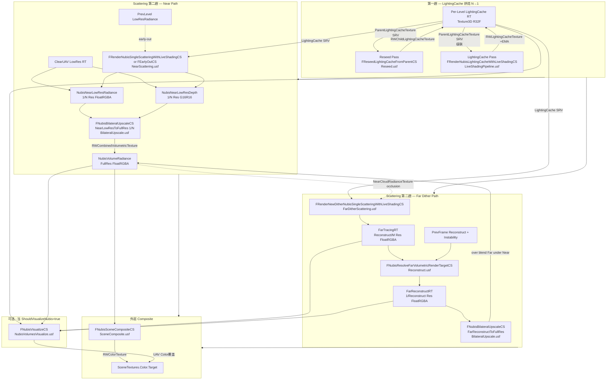

# NubisCloud RDG Pass 全图 — Live Shading Pipeline

> 目标：把 `RenderNubisVolumes`（一个 RDG_EVENT_SCOPE）展开成可读的 Pass DAG，并交叉引用 .cpp Pass 注册点 与 .usf shader entry。所有 Pass 名以 `RDG_EVENT_NAME / RDG_EVENT_SCOPE` 实际字串为准。

## 0. 入口路由 (raw#2 已提及，再列以便对照)

```
FDeferredShadingSceneRenderer::RenderNubisVolumes      // NubisVolumes.cpp:1049
└── RDG_EVENT_SCOPE("NubisVolumes")  +  RDG_GPU_STAT_SCOPE(NubisVolumesStat)
    └── for each View → for each NubisVolume MeshBatch (depth-sorted)
        ├── 第一趟  Level=N..1  (从远到近)
        │     RDG_EVENT_SCOPE("LightingCache Pass Level [%d]")
        │     ├── AddReseedLightingCachePasses(Config, ParentConfig)
        │     └── RenderNubisClipmapLevel(..., bLightingCacheOnly=true)
        └── 第二趟  Level=0..N  (从近到远，by Config.bUseDither/Octahedral 分流)
              RDG_EVENT_SCOPE("Scattering Pass Level [%d] (Near|FarDither|Octa)")
              └── RenderNubisClipmapLevel(..., bLightingCacheOnly=false,
                                            PrevNearLowResRadiance, &CurNearLowResRadiance)
```

`RenderNubisClipmapLevel`（NubisVolumesLiveShadingPipeline.cpp:2556）按 Config 分流：

| 条件 | 分支 | 入口 |
|---|---|---|
| `bLightingCacheOnly=true && UseLightingCacheForTransmittance() && bApplyShadowTransmittance` | LightingCache 烘焙 | `RenderLightingCacheWithLiveShading` (cpp:1098) |
| `bUseOctahedral` | Phase 3 [TODO] | `// TODO: RenderOctahedralScattering` |
| `bUseDither` | Far 路径 | `RenderTemporalSingleScatteringWithLiveShading` (cpp:2245) |
| 其它 (Near) | Near 路径 | `RenderNearCloudWithLiveShading` (cpp:2418) |

---

## 1. RDG Pass DAG (单 Volume / 6 个 Clipmap Level / Far+Near 混排)



注：图中 LightingCache 烘焙是**全 Level 共享**（最多前 5 级，Level 5 Octahedral 不烘），而 Near/Far/Octahedral 是**按 Level 分别选一个**分支。

---

## 2. Pass 表（按调度顺序）

| # | RDG Pass 名 (实际字串) | Shader 文件:行 | Shader 类 | Permutation | 主要 SRV 输入 | 主要 UAV 输出 | GroupCount | 备注 |
|---|---|---|---|---|---|---|---|---|
| 1 | `NubisLightingCacheReseed Level=%d Parent=%d Region(...)` | `NubisVolumesLightingCacheReseed.usf:46` | `FReseedLightingCacheFromParentCS` (NubisVolumes.cpp:901) | `DIM_HAS_PARENT 0/1` | `ParentLightingCacheTexture` | `RWChildLightingCacheTexture` | `DivUp(Region.Extent, 4)`，4³ 线程组 | 仅 Sector 滚动产生 dirty region 时跑；CVar `r.Nubis.LightingCacheReseedFromParent` |
| 2 | `RenderNubisLightingCacheWithLiveShadingCS [In-Scattering\|Transmittance] (Light=%s)` | `NubisVolumesLiveShadingPipeline.usf:349` | `FRenderNubisLightingCacheWithLiveShadingCS` (cpp:189-333) **MeshMaterial CS** | `DIM_LIGHTING_CACHE_MODE 0/1` | `MipSelectorTexture`, `ParentLightingCacheTexture`, ShadowDepth/VSM, ModelingVolumeTexture (材质) | `RWLightingCacheTexture` | `DivUp(CacheRes / AmortizeDivisor, 4)`，4³ 线程组 | 实际只跑 1/N³ voxel 之后做 EMA 写入；级联读父级 LC |
| 3 (Near) | `RenderSingleScatteringWithLiveShadingCS` 或 `EarlyOut` | `NubisVolumesNearScattering.usf:461 / 635` | `FRenderNubisSingleScatteringWithLiveShadingCS` (cpp:337) / `FRenderNubisSingleScatteringWithLiveShadingEarlyOutCS` (cpp:510) | `DIM_USE_TRANSMITTANCE_VOLUME / DIM_USE_INSCATTERING_VOLUME / DIM_USE_LUMEN_GI` | `LightingCache.LightingCacheTexture`, `MipSelectorTexture`, `SceneDepthCheckboardTexture`, `SceneDepthMinAndMaxTexture`, ShadowDepth/VSM, FogStruct, LumenGIVolume, **PrevLevelsRadianceTexture (early-out)** | `RWLightingTexture (RGBA Radiance + Alpha)`, `RWSecondaryLightingTexture`, `RWCloudDepthTexture` | `DivUp(NearRes, 8)` 8×8 | Level0 用普通 CS；Level1+ 用 EarlyOutCS，从前序 Level low-res 累积 alpha 早退；`r.NubisVolumes.NearCloudDownsampleFactor=2/4` |
| 4 (Near) | `NubisBilateralUpscale_NearLowResToFullRes (1/%d)` | `NubisVolumesBilateralUpscale.usf:796` | `FNubisBilateralUpscaleCS` (cpp:957) | `FHistoryAvailable / FReprojectionBoxConstraint / FCloudMinAndMaxDepth`（恒 set 1） | `FarReconstructVolumetricTexture (NubisNearLowResRadiance)`, `FarReconstructCloudDepthTexture (NubisNearLowResDepth)`, `SceneDepthTexture` | `RWCombinedVolumetricTexture` | `DivUp(FullRes, 8)` 8×8 | `CompositeBlendMode`：Level0=0 (覆盖)，Level1+=1 (Far under Near 公式); `NearDominanceEnabled` 由 CVar 控制 |
| 3 (Far) | `RenderNewFarDitherSingleScatteringWithLiveShading (Light=%s)` | `NubisVolumesFarDitherScattering.usf` (RenderNewDitherSingleScatteringWithLiveShadingCS) | `FRenderNewDitherNubisSingleScatteringWithLiveShadingCS` (cpp:680-857) | `DIM_USE_TRANSMITTANCE_VOLUME / DIM_USE_INSCATTERING_VOLUME / DIM_USE_LUMEN_GI`；强制 `CLOUD_MIN_AND_MAX_DEPTH=1` | `LightingCache.LightingCacheTexture`, `MipSelectorTexture`, `SceneDepthCheckboardTexture`, `SceneDepthMinAndMaxTexture`, **NearCloudRadianceTexture** (近景遮挡剔除), ShadowDepth/VSM, FogStruct, LumenGIVolume | `RWLightingTexture`, `RWSecondaryLightingTexture`, `RWCloudDepthTexture` (写入 FarTracingRT) | `DivUp(FarTracingRes, 8)` 8×8 | Bayer pattern 子像素抖动；`DitherFrameIndex/Count`；`NubisFarVolumeDitherOffset` |
| 4 (Far) | `ResolveFarDitherSingleScatteringWithLiveShading` | `NubisVolumesReconstruct.usf:349` | `FNubisResolveFarVolumetricRenderTargetCS` (cpp:860-955) | `PERMUTATION_HISTORY_AVAILABLE / SHADER_RECONSTRUCT_VOLUMETRICRT / CLOUD_MIN_AND_MAX_DEPTH`（cpp 强制全 true） | `TracingVolumetricTexture/...Depth`, `PreviousFrameVolumetricTexture/...Depth/...Instability`, `HalfResDepthTexture`, `SceneDepthTexture` | `RWTracingVolumetricTexture (Reconstruct RT)`, `RWTracingVolumetricDepthTexture`, `RWInstabilityTexture (R16F)` | `DivUp(ReconstructRes, 8)` 8×8 | per-Level Dither 双缓冲；DitherBlenderFactor 控制历史混合 |
| 5 (Far) | `NubisBilateralUpscale_FarReconstructToFullRes` | `NubisVolumesBilateralUpscale.usf:796` | `FNubisBilateralUpscaleCS` (同 #4 Near 共享) | (无效 Permutation，全 false) | `FarReconstructVolumetricTexture`, `FarReconstructCloudDepthTexture`, `SceneDepthTexture` | `RWCombinedVolumetricTexture` (`NubisVolumeTexture` Full-res) | `DivUp(FullRes, 8)` 8×8 | `CompositeBlendMode=1` (Far under Near，必然 over 已有近景结果) |
| 6 | `NubisSceneComposite` | `NubisVolumesSceneComposite.usf` | `FNubisSceneCompositeCS` (cpp:1369-1418, 全局 CS) | 无 | `VolumetricTexture (View.NubisVolumeRadiance)` | `RWColorTexture (SceneTextures.Color.Target)` | `DivUp(View.ViewRect, 8)` 8×8 | 在 Translucent 之后被调度 (CompositeNubisVolumes，cpp:1421) |
| 7 | `NubisVisualize Mode=%d` | `NubisVolumesVisualize.usf` | `FNubisVisualizeCS` (cpp:1594-1637, 全局 CS) | 无（运行时 ModeID） | `RadianceTexture/DepthTexture/LightingCacheTexture(3D)/FarTracingTexture/ReconstructTexture` | `RWOutputTexture (覆盖 SceneColor)` | `DivUp(View.ViewRect, 8)` 8×8 | 仅 `ShouldVisualizeNubis(View)`=true 时；CVar `r.NubisVolumes.Visualize.ClipmapLevel/LightingCacheSlice/...` |

> 说明：
> 1. 上表 Pass #2 实际是 **MeshMaterial Shader**（不是 GlobalShader），所以 GraphBuilder.AddPass 由 `AddComputePass<bWithLumen>` 模板包装，内部调用 `UE::MeshPassUtils::Dispatch(...)`，路径见 LiveShadingPipeline.cpp:1048-1093。
> 2. 所有 Light pass 都过滤 `LightType == LightType_Directional`（cpp:2623）— 当前只支持太阳光。
> 3. ClearUAVPass 仅在 Near 路径里显式调用（cpp:2468 / 2475）；Far 路径 ClearTracing/ReconstructRT 是 per-level DitherState 内部生命周期管理。

---

## 3. Shader Parameter 结构体（关键 Pass）

### 3.1 `FRenderNubisLightingCacheWithLiveShadingCS::FParameters` (cpp:196-269)

| 字段 | 类型 | 含义 |
|---|---|---|
| `View / SceneTextures / Scene` | UB | View Uniform / SceneTextures / FSceneUniformParameters |
| `bApplyEmissionAndTransmittance / bApplyDirectLighting / bApplyShadowTransmittance` | int | Light branch 控制 |
| `LightType / DeferredLight / VolumetricScatteringIntensity` | UB / scalar | Sun light 数据 |
| `ForwardLightData / VolumeShadowingShaderParameters / VirtualShadowMapSamplingParameters / VirtualShadowMapId` | UB | CSM/VSM 联合 |
| `LocalToWorld / WorldToLocal / LocalBoundsOrigin / LocalBoundsExtent / RayTraceBoundsExtent` | matrix/vec | 当前 Level 包围盒 (Local 含 Scale + Offset) |
| `PrimitiveId / CurrentMipLevel` | int | 当前 Level Mip 编号 (0~5) |
| `ClipmapScrollUVOffset` | float3 | 本级环形缓冲偏移 |
| `LocalToWorldArray[6] / WorldToLocalArray[6] / ClipmapScrollUVOffsetArray[6]` | matrix×6 / vec×6 | 6 套 per-mip 数据 (材质图按 EffectiveMip 切坐标系) |
| `MipSelectorTexture (Texture3D<uint>) / NubisSectorSize / NubisSectorWidth / NubisBaseVoxelSizeCm / NubisMipCount / NubisClipmapOriginSectorIdxArray[6] / NubisScrollOffsetSectorsArray[6]` | tex/uniform | per-sector 最细可用 mip 查询表 + 物理坐标换算 |
| `MaxShadowTraceDistance / MaxStepCount / bJitter` | scalar | Ray data |
| `AmortizedIndex / AmortizeDivisor / EmaHistory` | int/float | 时序分摊 + EMA β |
| `VoxelResolution / LightingCache (FNubisLightingCacheParameters)` | inc | 本级 transmittance/lighting cache 参数 |
| `bHasParentLightingCache / ParentLocalToWorld / ParentClipmapScrollUVOffset / ParentLightingCacheTexture / ParentLightingCacheTextureSampler` | flag/matrix/tex | **级联**：Level N 采父级 Level N+1 LC |
| `RWLightingCacheTexture (RWTexture3D<float>)` | UAV | 输出 |

### 3.2 `FNubisLightingCacheParameters` (NubisVolumes.h:104-113)

```cpp
BEGIN_SHADER_PARAMETER_STRUCT(FNubisLightingCacheParameters, )
    SHADER_PARAMETER(FIntVector, LightingCacheResolution)        // 本级 LC 3D 纹理分辨率
    SHADER_PARAMETER(float,      LightingCacheVoxelBias)         // CalcShadowBias 用
    SHADER_PARAMETER(FVector3f,  LightingCacheScrollUVOffset)    // 环形缓冲偏移
    SHADER_PARAMETER_RDG_TEXTURE(Texture3D, LightingCacheTexture)
END_SHADER_PARAMETER_STRUCT()
```

USF 端见 `NubisVolumesTransmittanceVolumeUtils.ush:36-93`。

### 3.3 `FNubisBilateralUpscaleCS::FParameters` (cpp:968-986)

| 字段 | 含义 |
|---|---|
| `FarReconstructVolumetricTextureSizeAndInvSize / FarReconstructToVolumetricBufferResolutionScale` | 上采样比例 (1/N, N) |
| `FarReconstructVolumetricTexture / FarReconstructCloudDepthTexture / SceneDepthTexture` | 输入 |
| `CompositeBlendMode` | 0=覆盖，1=Far under Near |
| `NearDominanceEnabled / NearDominanceStartAlpha / NearDominanceEndAlpha` | Soft Near Dominance Blend，根据已有 Near alpha 压制 Far 贡献 |
| `RWCombinedVolumetricTexture` | 全分辨率输出 |

### 3.4 `FNubisResolveFarVolumetricRenderTargetCS::FParameters` (cpp:869-896)

含 `TracingVolumetric / SecondaryTracingVolumetric / TracingVolumetricDepth`、`PreviousFrame*` 三件套（Tex + Depth + Instability）、`HalfResDepthTexture / SceneDepthTexture`、`DitherBlenderFactor`、`CurrentTracingPixelOffset`、`NubisFarTracingRTDownsampleFactor / VolumetricReconstructRTDownsampleFactor`、`DebugResolveMode`，输出 `RWTracingVolumetricTexture / RWTracingVolumetricDepthTexture / RWInstabilityTexture`。

---

## 4. .usf 关键代码摘录

### 4.1 LightingCache EMA 主循环 (NubisVolumesLiveShadingPipeline.usf:348-486)

```hlsl
[numthreads(THREADGROUP_SIZE_3D, THREADGROUP_SIZE_3D, THREADGROUP_SIZE_3D)]
void RenderNubisLightingCacheWithLiveShadingCS(uint3 DispatchThreadId : SV_DispatchThreadID)
{
    if (any(DispatchThreadId >= uint3(LightingCacheResolution) / uint(AmortizeDivisor))) return;

    // 时序分摊：N×N×N 中选 1 个偏移 (AmortizeDivisor=2 → 8 帧轮转)
    int AmortizeTotal  = AmortizeDivisor * AmortizeDivisor * AmortizeDivisor;
    int TemporalIndex  = AmortizedIndex % AmortizeTotal;
    int3 TemporalOffset = int3(
        TemporalIndex % AmortizeDivisor,
        (TemporalIndex / AmortizeDivisor) % AmortizeDivisor,
        (TemporalIndex / (AmortizeDivisor * AmortizeDivisor)) % AmortizeDivisor);
    float3 LogicVoxelIndex = float3(DispatchThreadId * AmortizeDivisor + TemporalOffset);

    // logic→physical 换算 (sector 滚动后 EMA 历史不会错位)
    float3 LogicUVW    = (LogicVoxelIndex + VoxelJitter) / float3(GetLightingCacheResolution());
    float3 PhysicalUVW = frac(LogicUVW + ClipmapScrollUVOffset + 1.0);
    uint3  PhysicalVoxelIndex = uint3(floor(PhysicalUVW * float3(GetLightingCacheResolution())));

    // MipSelector 决定实际可采的 mip (空洞兜底)
    float MipLevel    = (float)CurrentMipLevel;
    uint  MinMip      = QueryMinSectorMipAtWorldPos(WorldRayOrigin, (int)MipLevel);
    float EffectiveMip = (float)max((int)MipLevel, (int)MinMip);
    float3 Extinction = SampleExtinction(CreateVolumeSampleContext(..., EffectiveMip));
    if (all(Extinction < 1e-7)) { RWLightingCacheTexture[PhysicalVoxelIndex] = 0.0f; return; }

    // 沿光照方向 raymarch 出 OpticalDepthToLight
    ComputeSunLightTransmittance(WorldRayOrigin, ToLight, MipLevel,
        TransmittanceToLight, OpticalDepthToLight);

    // 级联：终点落在父级 AABB 内时，把父级 OD 直接累加（避免本级跑全程）
    if (bHasParentLightingCache && bEndInParent) {
        float3 ParentUVW = frac((ParentLocalPos - ParentBoundsMin) / (ParentBoundsMax - ParentBoundsMin)
                              + ParentClipmapScrollUVOffset);
        OpticalDepthToLight += ParentLightingCacheTexture.SampleLevel(
            ParentLightingCacheTextureSampler, ParentUVW, 0).r;
    }

    // EMA: New = lerp(NewSample, OldHistory, β)，β = EmaHistory（per-Level，近景 0.9，远景更大）
    float OriOpticalDepthToLight = RWLightingCacheTexture[PhysicalVoxelIndex];
    RWLightingCacheTexture[PhysicalVoxelIndex] = lerp(OpticalDepthToLight, OriOpticalDepthToLight, EmaHistory);
}
```

> EMA 公式核心：`LC_new = lerp(NewOpticalDepth, LC_old, β)` ⇒ 等价 `α = 1-β`（新值权重）。
> Per-Level β 由 `Config.LightingCacheEmaHistory` 注入（cpp:1227）；近景 0.9 / 远景更大可减少时序闪烁。

### 4.2 LightingCacheReseed（NubisVolumesLightingCacheReseed.usf 全文，75 行）

```hlsl
[numthreads(THREADGROUP_SIZE_3D, THREADGROUP_SIZE_3D, THREADGROUP_SIZE_3D)]
void ReseedLightingCacheFromParentCS(uint3 DispatchThreadId : SV_DispatchThreadID)
{
    int3 ChildVoxel = DirtyRegionMin + int3(DispatchThreadId);
    if (any(ChildVoxel >= DirtyRegionMax)) return;

#if DIM_HAS_PARENT
    // 1) 物理 voxel → 本级逻辑 UV
    float3 ChildPhysUV    = ((float3)ChildVoxel + 0.5f) / (float3)ChildResolution;
    float3 ChildLogicalUV = frac(ChildPhysUV - ChildClipmapScrollUVOffset + 1.0f);
    // 2) 本级逻辑 UV → 父级逻辑 UV  (ParentScale = 2 × ChildScale ⇒ Scale=0.5)
    float3 ParentLogicalUV = ChildLogicalUV * ChildToParentUVScale + ChildToParentUVBias;
    // 3) 父级逻辑 UV → 父级物理 UV (frac 包卷)
    float3 ParentPhysUV = frac(ParentLogicalUV + ParentClipmapScrollUVOffset + 1.0f);
    // 4) 三线性采样父级 LC
    RWChildLightingCacheTexture[ChildVoxel] =
        ParentLightingCacheTexture.SampleLevel(ParentLightingCacheTextureSampler, ParentPhysUV, 0).r;
#else
    RWChildLightingCacheTexture[ChildVoxel] = 0.0f;  // 最高 Level 无父级 → 写 0 保守起点
#endif
}
```

### 4.3 RayMarch 主循环 + MipSelector sector 跳跃（NubisVolumesRayMarchingNear.ush:51-160 节选）

```hlsl
void RayMarchSingleScattering(FRayMarchingContext RayMarchingContext, ...) {
    int3 PrevSectorIdx     = int3(-INT_MAX, -INT_MAX, -INT_MAX);
    uint CurSectorMinMip   = NUBIS_MIPSELECTOR_EMPTY_MIP;  // 7 = 空 sector 哨兵
    bool bCurSectorHasCloud= false;

    while (any(Transmittance > Epsilon) &&
           LocalViewTracedDistance < LocaViewMaxTraceDistance &&
           StepCount < MaxSteps)
    {
        ++StepCount;
        float3 LocalPosition = ...;  float3 WorldPosition = ...;

        // ---- MipSelector：跨 sector 边界才重新 Load Texture3D<uint> ----
        int3 CurSectorIdx = WorldPosToSectorIndex(WorldPosition, RayMarchingContext.MipLevel);
        if (any(CurSectorIdx != PrevSectorIdx)) {
            uint Packed = QueryMipSelectorEntry(CurSectorIdx, RayMarchingContext.MipLevel);
            bCurSectorHasCloud = MipSelectorHasCloud(Packed);
            CurSectorMinMip    = bCurSectorHasCloud ? MipSelectorMinMip(Packed) : NUBIS_MIPSELECTOR_EMPTY_MIP;
            PrevSectorIdx      = CurSectorIdx;
        }
        // 空 sector 或 "本 sector 最细 mip 比本 Level 更细" → slab test 跳到 sector 出口
        bool bSkipByFinerMip = ((int)CurSectorMinMip < RayMarchingContext.MipLevel)
                            && (MipRingEarlyExitEnabled == 0u);
        if (!bCurSectorHasCloud || bSkipByFinerMip) {
            // ...slab test 算 tExit，整段跳过...
            LocalViewTracedDistance += max(ExitLocal, 1.0f);
            continue;
        }
        // 自适应步长：max(MinStepM, sqrt(distM)*StepCoeff*StepFactor) × StepGlobalGain × m→cm
        float AdaptiveStepSize = ...;
        // 采 LC + 采 Material + ComputeInscattering + 累加 Transmittance×Inscatter ...
    }
}
```

> MipSelector Atlas 是 `Texture3D<uint>` 的 PF_R8_UINT，每 sector 一个 byte：bit0 = `HasCloud`，bit1-3 = `MinMip ∈ [0,7]`，7 是空 sector 哨兵。物理坐标换算 `(Global - Origin + Scroll) mod Width`（NubisVolumesRayMarchingUtils.ush:131-148）。

---

## 5. A5 — Sparse Voxel 两级 [推测/验证]

**结论：HiGame 当前分支并未真正启用 Sparse Voxel 两级网格**。证据链：

- `r.NubisVolumes.SparseVoxel`（CVarNubisVolumesSparseVoxel）默认 0（NubisVolumes.cpp:202-207），且 grep 整个 `Engine/Source/Runtime/Renderer/Private/NubisVolumes` 与 `Engine/Shaders/Private/NubisVolumes` 找不到 `BottomLevelGrid`、`IndirectionGrid`、`PerTileCulling`、`RayTracingScene` 的真正实现入口。
- `NubisVolumes::GetBottomLevelGridResolution() / GetIndirectionGridResolution() / EnableIndirectionGrid() / EnableLinearInterpolation()` 在 `NubisVolumes.h:76-89` 仅做了**前向声明**，cpp 中**没有定义**（grep `CVarNubisVolumesBottomLevel|CVarNubisVolumesIndirection|EnableIndirectionGrid|EnableLinearInterpolation` 0 hit）。这些声明是 5.7 / NvCloud 上游或 Phase 3 的 stub，HiGame fork 未实装。
- 唯一活的 Sparse Voxel CVar：`r.NubisVolumes.SparseVoxel.GenerationMipBias=3`（cpp:209）、`PerTileCulling=1`（cpp:216）、`Refinement=1`（cpp:223），但这些值只通过 `NubisVolumes::GetSparseVoxelMipBias / UseSparseVoxelPipeline / UseSparseVoxelPerTileCulling / ShouldRefineSparseVoxels` 暴露，**没有任何调用方**（grep 这些函数仅在 .h 声明 + .cpp 定义，无消费点）。
- HiGame 实际用来"加速空气段"的机制是 **MipSelector Atlas + Sector 跳跃**（见 4.3 与 raw#1 已论述），**这是 HiGame 自研的两级结构**：
  - **粗粒度 (sector 级)**：`Texture3D<uint>` PF_R8_UINT，每 sector 1 byte，`HasCloud + MinMip` 打包，跨 sector 边界才查表，空 sector slab-test 一次跳一整 sector。
  - **细粒度 (voxel 级)**：用 `ModelingVolumeTexture_MipN`（材质图引用的 6 档 SVT mip 体积纹理），由 `EffectiveMip = max(PassMip, MinMip)` 选档，确保该位置有数据才采。
- **两级结构的本质**：MipSelector 等价于上游 Nubis 的"Indirection Grid"（决定该 tile 要不要进、要采哪一档），Sector 内的 SVT mip 体积纹理等价于"Bottom Level Grid"。**HiGame 没有用 Indirection 间接 Buffer 索引到 Bottom Level，而是直接用 sector 坐标 hash 进 Atlas + 用 Mip 编号进多档 3D 纹理**——这是 Clipmap+SVT 路线的特化简化。
- `SparseVoxelMipBias=3` 的"作用"在 HiGame 里更像是占位默认值，不被消费；上游 Nubis 里它控制 Bottom Level 生成时偏向哪一档 mip 抽稀，HiGame 等价物是 Bake 期 `MergeMipLevel >= SectorMipLevel` 的判定（见 raw#1 烘焙文档）。

---

## 6. A6 — LightingCache + Transmittance Volume

| 字段 | 类型 | 说明 |
|---|---|---|
| `LightingCacheResolution` | `FIntVector` | 本级 3D 纹理体素分辨率，由 `Config.ScatteringCacheVoxelResolution` 注入 |
| `LightingCacheVoxelBias` | `float` | shader 端 `CalcShadowBias()`：体素对角线 × 此因子，作为阴影 ray 起点偏移，防自阴影 |
| `LightingCacheScrollUVOffset` | `float3` | 环形缓冲偏移；shader 端 `PhysicalUV = frac(LogicUV + Offset)` 做读写两端镜像换算（见 4.1 与 4.2） |
| `LightingCacheTexture` | `Texture3D` (R32F) | 存储**光学深度** OpticalDepthToLight；Sample 端用三线性 + 全局 SharedTrilinearClampedSampler |

`r.NubisVolumes.LightingCache` 三态（NubisVolumes.cpp:230-238）：

| 值 | API | 控制的 Pass |
|---|---|---|
| 0 | 全 false | 无 LC 烘焙；Near/Far/LCBake 都跳过 LightingCache 路径 |
| 1 | `UseLightingCacheForTransmittance()=true` | LightingCache Pass 烘焙；Far/Near CS Permutation `DIM_USE_TRANSMITTANCE_VOLUME=true`，shader 在 raymarch 内用 LC 采阴影透射率 |
| 2 | `UseLightingCacheForInscattering()=true` | 同 1；Permutation `DIM_USE_INSCATTERING_VOLUME=true`，shader 用 LC 采内散射 |

**Reseed → EMA 流水**（每 Level、每光源）：

1. 第一趟前置：`AddReseedLightingCachePasses` 遍历 `LevelConfig.LightingCacheDirtyRegions`，对每个 dirty region dispatch `FReseedLightingCacheFromParentCS`，把刚滚动出的物理 voxel 用父级 LC 三线性采样填上；最高 Level 写 0。
2. 第一趟主体：`FRenderNubisLightingCacheWithLiveShadingCS` 按 `AmortizeDivisor=Config.LightingCacheAmortizeDivisor`（默认 2）做 N×N×N 时序分摊（每帧只更新 1/8 voxel），EMA 历史权重由 `Config.LightingCacheEmaHistory` 控制。
3. 第二趟散射：Near/Far CS 通过 `FNubisLightingCacheParameters` 把本级 LC 作为 SRV 绑入，用 `SampleLightingCache(LogicUV, MipLevel)` 查阴影透射率。

**`LightingCacheScrollUVOffset` 用法**（写入端 + 读取端必须严格镜像）：
- 写入端 (LightingCache CS, LiveShadingPipeline.usf:388)：`PhysicalUVW = frac(LogicUVW + ClipmapScrollUVOffset + 1.0)`
- 读取端 (TransmittanceVolumeUtils.ush:84)：`PhysicalUVW = frac(UVW + LightingCacheScrollUVOffset + 1.0)`
- Reseed 端 (LightingCacheReseed.usf:57/63)：物理→子逻辑→父逻辑→父物理 三段 frac 链

这套设计的目的：sector 滚动时 logic↔physical 映射整体平移，**物理 voxel 的 logic 含义保持稳定**，EMA 历史与新 trace 在世界含义上对齐，不闪烁。

---

## 7. A7 — Hardware Ray Tracing 集成

**结论：HiGame 当前分支没有把 HW RT 接到 NubisCloud 的任何 Pass 上**。

- `r.NubisVolumes.HardwareRayTracing` 默认 0（NubisVolumes.cpp:34-39）。
- `NubisVolumes::UseHardwareRayTracing()` 实现存在（cpp:512-516），返回 `IsRayTracingEnabled() && CVar != 0`，但**没有任何调用方**（grep 整个 NubisVolumes 目录 0 hit）。
- `class FRayTracingScene;` 在 `NubisVolumes.h:15` 是 forward declare，但 .cpp 没 `#include "RayTracing/RayTracingScene.h"`，也没用过 `FRayTracingScene` 类型。
- 所有 NubisCloud Compute Pass 都走 SF_Compute（不是 SF_RayGen / SF_RayHit），没有 RayGen 着色器。
- PS5 与 Win64 在这个问题上行为一致：都不走 HW RT 路径；fallback 即"主路径"——**MipSelector Atlas + Sector 跳跃 + Per-Level LightingCache + 体积阴影 (CSM/VSM)**。

可能的 [推测]：上游 Nubis 论文 / NvCloud 5.7 用 HW RT 做 BLAS 包住 Sparse Voxel 集合，每根视线一次 RT instance hit 列表 + sector 线性 march。HiGame 跳过这一层，原因可能是 PS5/Win64 共用代码路径 + DDS 服务器无 RT，且 MipSelector + 多档 SVT 已经把空气段加速到一个数量级，HW RT 边际收益不显著。需查 raw#? Tencent commit 说明确认。

---

## 8. 开放问题

1. **Octahedral 路径 (Phase 3)**：cpp:2649-2653 `if (Config.bUseOctahedral)` 分支只有 `// TODO: RenderOctahedralScattering(...)`，没有任何实现。这一档 Mip5 的"远场云壳"目前怎么补？是否走 Far Dither + 一个特殊 Material？
2. **`bWithLumen` AddComputePass 模板分支**：LiveShadingPipeline.cpp:1048-1093 `template<bool bWithLumen, ...>` 在 LightingCache 时传 false，散射时传 true，但 false 分支也走同一个 lambda，唯一区别在 Lumen UB 是否 SetParameter（cpp:1085-1087）。是否意味着 LightingCache 不支持 Lumen GI？逻辑上 LC 是阴影透射率不是辐射，确实不需要——但需材质验证。
3. **`LightingCacheDirtyRegions` 的填充时机**：cpp:1004 遍历但 grep 整个仓库要确认 `FNubisClipmapLevelRenderConfig::FDirtyRegion` 是从 `NubisClipmapManager` Update 时填的还是 Render Tick 内构造（影响多 View 时是否会漏 reseed）。
4. **`MaxLightingCacheLevels=5`**：cpp:1208 hard-code，与 `NubisDefaults::MipCount` 是否一致？Mip 5 跳过 LC 是否就是 Octahedral 不需要的设定？
5. **EarlyOut Near 的 `PreviousLevelsRadianceTexture` 尺寸约束**：cpp:2449 注释强调"必须与当前 Level 低分辨率 RT 尺寸一致"，但 Level0 vs Level1 的 NearDownsampleFactor 都来自同一个全局 CVar（cpp:2457），所以始终一致；如果未来要做 per-Level Near 分辨率，这里会断。
6. **`FNubisBilateralUpscaleCS` 的 Permutation 实际无效**：cpp:961-966 三个 Permutation Bool 都没在 cpp 端被 set（PermutationVector 直接默认构造 → 全 false），且 cpp:1032-1034 在 ModifyCompilationEnvironment 又把 `SHADER_RECONSTRUCT_VOLUMETRICRT / PERMUTATION_HISTORY_AVAILABLE` 全 hard-set=1。Permutation 系统在这里是死代码，等同 0 个 permutation 编译。是否值得清理？
7. **`LightingCacheScrollUVOffset` vs `ClipmapScrollUVOffset` 在 PassParameters 中同时存在**（cpp:1194 / 1221）：是同一个 `FVector3f`，只是分别填到 outer scope 和 LC inclusion，shader 端通过两个不同 uniform 名访问。如果 Per-Level LC 与 Per-Level Clipmap 滚动彻底解耦（例如 LC 不滚但 Sample 滚），这里需要重新审视。当前实现两者绑同一个值。
