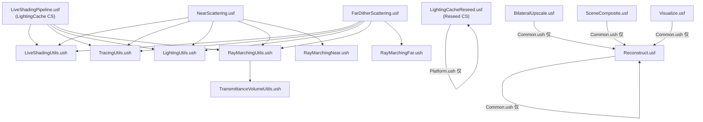

# NubisCloud Shader 入口 / Permutation Domain / 工具库依赖图

本笔记从 P4 主分支验证：

- 8 个 `.usf` (CS 入口) + 7 个 `.ush` (工具库)，共 11,234 行代码
- 9 个 Shader 类，分布于 2 个 `.cpp`（`NubisVolumes.cpp` 与 `NubisVolumesLiveShadingPipeline.cpp`）
- `IMPLEMENT_GLOBAL_SHADER` × 3 + `IMPLEMENT_MATERIAL_SHADER_TYPE` × 6 = 9 处注册

---

## 表 1: Shader 入口大表（按 .usf 分组）

| .usf 文件 | 入口函数 | Shader 类（.cpp） | 频率 | Permutation Domain | 调用 Pass | 关键 SRV / UAV |
|---|---|---|---|---|---|---|
| `NubisVolumesLiveShadingPipeline.usf` | `RenderNubisLightingCacheWithLiveShadingCS` | `FRenderNubisLightingCacheWithLiveShadingCS` (Pipeline.cpp:189) | CS 4×4×4 | `FLightingCacheMode`(int 0..1) | LightingCache 烘焙 (raw#3 Pass2) | `RWTexture3D<float> RWLightingCacheTexture`，输入 `MipSelectorTexture`、`ParentLightingCacheTexture`、`FVolumeShadowingShaderParameters` |
| `NubisVolumesLightingCacheReseed.usf` | `ReseedLightingCacheFromParentCS` | `FReseedLightingCacheFromParentCS` (NubisVolumes.cpp:901) | CS 4×4×4 | `FHasParent`(bool) | sector 滚动当帧 reseed (raw#3 Pass1) | `Texture3D<float> ParentLightingCacheTexture`，`RWTexture3D<float> RWChildLightingCacheTexture` |
| `NubisVolumesNearScattering.usf` | `RenderSingleScatteringWithLiveShadingCS` | `FRenderNubisSingleScatteringWithLiveShadingCS` (Pipeline.cpp:337) | CS 8×8 | `FUseTransmittanceVolume`,`FUseInscatteringVolume`,`FUseLumenGI` (3 bool→8 排列) | Near Pipeline (raw#3 Pass3a) | `RWLightingTexture`、`RWSecondaryLightingTexture`、`RWCloudDepthTexture`；输入 `LightingCacheTexture`、Lumen GI、VSM |
| `NubisVolumesNearScattering.usf` | `RenderSingleScatteringWithLiveShadingEarlyOutCS` | `FRenderNubisSingleScatteringWithLiveShadingEarlyOutCS` (Pipeline.cpp:510) | CS 8×8 | 同上（3 bool） | Near Pipeline 多 Mip 串行（PreviousLevelsRadianceTexture 累积不透明 ≥0.99 跳过） | 多一个输入 `Texture2D<float4> PreviousLevelsRadianceTexture` |
| `NubisVolumesFarDitherScattering.usf` | `RenderNewDitherSingleScatteringWithLiveShadingCS` | `FRenderNewDitherNubisSingleScatteringWithLiveShadingCS` (Pipeline.cpp:682) | CS 8×8 | `FUseTransmittanceVolume`,`FUseInscatteringVolume`,`FUseLumenGI` (3 bool) | Far Dither Pipeline (raw#3 Pass3b) | 同 Near Pipeline + `NearCloudRadianceTexture` 用作近景遮挡剔除 |
| `NubisVolumesReconstruct.usf` | `ResolveNubisVolumetricRenderTargetCS` | `FNubisResolveFarVolumetricRenderTargetCS` (Pipeline.cpp:860) | CS 8×8 | `FHistoryAvailable`,`FReprojectionBoxConstraint`,`FCloudMinAndMaxDepth` (3 bool→8 排列) | Far Reconstruct (raw#3 Pass4) | 输入 `PreviousFrameVolumetricTexture`、`PreviousFrameVolumetricDepthTexture`、`PreviousFrameInstabilityTexture`；输出 `RWTracingVolumetricTexture`、`RWTracingVolumetricDepthTexture`、`RWInstabilityTexture` |
| `NubisVolumesBilateralUpscale.usf` | `NubisVolumesBilateralUpscaleCS` | `FNubisBilateralUpscaleCS` (Pipeline.cpp:957) | CS 8×8 | `FHistoryAvailable`,`FReprojectionBoxConstraint`,`FCloudMinAndMaxDepth` (3 bool；`FUpscaleMode` 已注释，改为 `#define UPSCALE_MODE`) | 双边上采样到全分辨率 (raw#3 Pass5) | `FarReconstructVolumetricTexture`、`FarReconstructCloudDepthTexture`、`SceneDepthTexture` → `RWCombinedVolumetricTexture` |
| `NubisVolumesSceneComposite.usf` | `NubisVolumesSceneCompositeCS` | `FNubisSceneCompositeCS` (NubisVolumes.cpp:1369) | CS 8×8 | 无 | 最终合成 (raw#3 Pass6) | `Texture2D<float4> VolumetricTexture` → `RWTexture2D<float4> RWColorTexture` |
| `NubisVolumesVisualize.usf` | `NubisVisualizeCS` | `FNubisVisualizeCS` (NubisVolumes.cpp:1594) | CS 8×8 | 无（运行期 `VisualizationMode` uint） | 调试可视化（仅 r.NubisVolumes.Visualize 开启时） | 多输入：`RadianceTexture/DepthTexture/LightingCacheTexture/FarTracingTexture/ReconstructTexture` → `RWOutputTexture` |

> 备注：所有 9 个 CS 都禁用 RT pipeline；NubisCloud 在 shader 层无 `TraceRay` / `TraceRayInline` 调用（详见 A7 章节）。

---

## 表 2: Permutation Domain 详表

| Shader 类 | Permutation 名 | 类型 | 取值 | 触发条件 / 含义 |
|---|---|---|---|---|
| `FReseedLightingCacheFromParentCS` | `FHasParent` | BOOL | 0/1 | `1` = 父级 LightingCache 存在 → 三线性采样回填；`0` = 最高 Level 无父级 → 写 0（保守起点） |
| `FRenderNubisLightingCacheWithLiveShadingCS` | `FLightingCacheMode` | INT(0..1) | 0/1 | `DIM_LIGHTING_CACHE_MODE` 选择 LightingCache 输出语义（推测：0=OpticalDepth, 1=Transmittance；shader 内仅一种实现，疑为预留扩展位） |
| `FRenderNubisSingleScatteringWithLiveShadingCS` | `FUseTransmittanceVolume` | BOOL | 0/1 | 是否启用 LightingCache 加速直接光阴影。0=每步全 RayMarch 阴影，1=步数 ≥2 后查 3D 缓存 |
| `FRenderNubisSingleScatteringWithLiveShadingCS` | `FUseInscatteringVolume` | BOOL | 0/1 | 是否使用 Volumetric Fog InscatteringVolume（推测：与高度雾 InscatteringVolume 联动） |
| `FRenderNubisSingleScatteringWithLiveShadingCS` | `FUseLumenGI` | BOOL | 0/1 | 启用 Lumen Translucency GI 体积作为间接光源；关闭走 SkyIrradianceEnvironmentMap SH 路径 |
| `FRenderNubisSingleScatteringWithLiveShadingEarlyOutCS` | 同上 3 bool | BOOL | 0/1 | 多 Mip 链 EarlyOut 路径（前序 Level α≥0.99 直接跳过） |
| `FRenderNewDitherNubisSingleScatteringWithLiveShadingCS` | 同上 3 bool | BOOL | 0/1 | Far Dither Pipeline 的同一 3 维开关 |
| `FNubisResolveFarVolumetricRenderTargetCS` | `FHistoryAvailable` (`PERMUTATION_HISTORY_AVAILABLE`) | BOOL | 0/1 | 历史帧 ViewState 是否存在；`0` 走纯当前帧 + 双线性 fallback；C++ 端在 `ModifyCompilationEnvironment` 中又强制 `=1`（[推测] 历史代码遗留，permutation 实际只编 1 份） |
| `FNubisResolveFarVolumetricRenderTargetCS` | `FReprojectionBoxConstraint` (`SHADER_RECONSTRUCT_VOLUMETRICRT`) | BOOL | 0/1 | 是否启用 8 邻居 AABB Color Clamp（防 ghost）；同样被 ModifyCompilationEnvironment 强制 `=1` |
| `FNubisResolveFarVolumetricRenderTargetCS` | `FCloudMinAndMaxDepth` | BOOL | 0/1 | 是否启用 Primary/Secondary 双 RT（最近/最远深度）+ Path B 深度插值 |
| `FNubisBilateralUpscaleCS` | 同上 3 bool | BOOL | 0/1 | （`FUpscaleMode` 原 0..2 RANGE_INT 已被注释，目前用 shader 端 `#define UPSCALE_MODE 0` 调试切换 4 种 kernel） |
| `FNubisSceneCompositeCS` | — | — | — | 无 permutation；唯一 Pass |
| `FNubisVisualizeCS` | — | — | — | 无 permutation；运行期 uint `VisualizationMode` 选择路径 |

**总编译变体数估算**：
- 3×Near/Far Scattering 类各 8 排列 × N 种 Material（FMeshMaterialShader）→ 实际数量取决于 `DoesMaterialShaderSupportNubisVolumes` 过滤。
- Reconstruct/BilateralUpscale 因 ModifyCompilationEnvironment 内 `SetDefine(...,1)` 强制注入，等价"只编 `FCloudMinAndMaxDepth` 二分"——其余两个 bool 实际只有 `=1` 一种产物（[推测]，待 ShaderPipelineCache 验证）。

---

## 图 1: .ush 工具库依赖图（Mermaid，从 `#include` 实证）



**关键观察**：
- 主路径 `LSP / NS / FDS` 三入口共用 `LSU + TU + LU + RMU` 4 件套
- `RMU` 是中枢，下挂 `TVU`（光照缓存采样）+ Lumen GI + DeferredLighting + SHCommon + ForwardShadowingCommon
- `RMN` 与 `RMF` 互斥：Near 链只 include RMN，Far 链只 include RMF（注释明确"两个文件可独立调整参数互不影响"）
- `LightingCacheReseed.usf` 是孤立模块，只 include `Platform.ush`
- `Reconstruct/BilateralUpscale/SceneComposite/Visualize` 都是后处理，只依赖 `Common.ush`

---

## 表 3: 工具库 .ush 关键函数清单

| .ush 文件 | 主要函数 / 类型 | 用途 |
|---|---|---|
| `LiveShadingUtils.ush` | `GetPrimitiveData(PrimitiveId, LocalToWorld, WorldToLocal, BoundsOrigin, BoundsExtent)` 3 重载 | 用手动 Uniform 覆盖 GPU Scene 的 PrimitiveData（CS 不走 Mesh Pipeline） |
| `LiveShadingUtils.ush` | `SampleExtinctionCoefficients` / `SampleEmissive` / `SampleAlbedo` | 从 PixelMaterialInputs 提取 σt / Le / albedo（Strata 走 `VOLUMETRICFOGCLOUD_EXTINCTION/ALBEDO`，非 Strata 走 SubsurfaceColor/BaseColor） |
| `LightingUtils.ush` | `InitDeferredLightFromUniforms(LightType, VolumetricScatteringIntensity)` | 初始化 FDeferredLightData 并用 `VolumetricScatteringIntensity` 缩放 Color |
| `TracingUtils.ush` | `IntersectAABB(RayO, RayD, tMin, tMax, BoxMin, BoxMax)` | Slab Method 射线-AABB 相交，返回 `float2(tEntry, tExit)` |
| `RayMarchingUtils.ush` | `Remap` / `ValueRemap` (float/2/3/4) | 值域映射（带/不带 saturate） |
| `RayMarchingUtils.ush` | `QueryMipSelectorEntry` / `MipSelectorHasCloud` / `MipSelectorMinMip` / `WorldPosToSectorIndex` / `QueryMinSectorMipAtWorldPos` | MipSelector Atlas 查询：解码 sector 是否有云、最细可用 mip（PF_R8_UINT，bit0=HasCloud, bit1~3=MinSectorMipLevel） |
| `RayMarchingUtils.ush` | `FRayMarchingContext` 结构体 + `CreateRayMarchingContext` | RayMarch 上下文打包（射线、StepFactor、MipLevel、Lighting flags） |
| `RayMarchingUtils.ush` | `CalcStepSize` / `CalcShadowStepSize` / `CalcShadowBias` | 自适应步长、阴影步长、阴影偏移（基于 LightingCache voxel 大小） |
| `RayMarchingUtils.ush` | `MultiScatteringApproximate` | 多重散射近似（Wrenninge 风格 N-octave） |
| `RayMarchingUtils.ush` | `RayMarchSunLightTransmittance` / `ComputeSunLightTransmittance` (2 重载) | 阳光透射率步进；前 2 步全 RayMarch，第 3 步起切到 LightingCache 查表（DIM_USE_TRANSMITTANCE_VOLUME=1） |
| `RayMarchingUtils.ush` | `ComputeInscattering` | 单次散射 in-scatter 计算（HG 双瓣相位 + CSM/VSM 阴影 + 多重散射） |
| `RayMarchingNear.ush` | `RayMarchSingleScattering` | Near Pipeline 主循环；MipSelector 整 sector 跳过 + SDF×0.5 sphere tracing 云外推进；StepGlobalGain=2.0 |
| `RayMarchingFar.ush` | `RayMarchDitherSingleScattering` | Far Dither 主循环；StepFactor=DitherFrameCount；CLOUD_MIN_AND_MAX_DEPTH 双 RT（Primary 全深度 + Secondary 仅最近表面前） |
| `TransmittanceVolumeUtils.ush` | `SampleLightingCache(UVW, MipLevel)` | 三线性采样 3D LightingCache，logic→physical 用 `frac(UVW + LightingCacheScrollUVOffset)` |
| `TransmittanceVolumeUtils.ush` | `GetLightingCacheResolution` / `GetLightingCacheVoxelBias` | 缓存分辨率、阴影偏移因子 getter |

---

## A7: Hardware Ray Tracing 在 Shader 中的体现

**结论：NubisCloud shader 层零 HWRT 调用**。

证据：

1. `Engine\Shaders\Private\NubisVolumes\` 全目录 grep `RAY_TRACING|TraceRay|RAYTRACING|ConeTrace|TraceRayInline` → **0 命中**
2. C++ 侧 `NubisVolumes.h:81` 声明 `bool UseHardwareRayTracing();` 与 `NubisVolumes.cpp:512`：

   ```cpp
   bool UseHardwareRayTracing()
   {
       return IsRayTracingEnabled()
           && (CVarNubisVolumesHardwareRayTracing.GetValueOnRenderThread() != 0);
   }
   ```

   CVar `r.NubisVolumes.HardwareRayTracing` (NubisVolumes.cpp:34) 已存在，但当前 shader 端无任何分支消费此 flag。

3. RayMarch 全部基于 **Sparse Voxel + LightingCache** 的纯 SM5 Compute：
   - 视线步进：`RayMarchSingleScattering` / `RayMarchDitherSingleScattering` 用 `SampleVoxelCloudDistance` + `SampleExtinction` 在 BC1 SDF + Modeling 体积上做 sphere tracing
   - 阴影步进：`RayMarchSunLightTransmittance` 前 2 步全 raymarch、之后查 `SampleLightingCache`（3D 纹理）
   - 阴影 fallback：`#if HARD_SURFACE_SHADOWING` 走 CSM (`ForwardShadowingCommon.ush`) + VSM (`VirtualShadowMapProjectionCommon.ush`)

**[推测]** `r.NubisVolumes.HardwareRayTracing` CVar 是 Guerrilla 路线图占位、目前未接通；当前生产路径 100% 走 Sparse Voxel。后续若启用 HWRT，应补 `#if RAY_TRACING` 分支替换 `RayMarchSunLightTransmittance` 的 inline shadow trace（[推测]）。

---

## A8: Temporal & Bilateral Upscale 的 Shader 实现

### A8.1 `Reconstruct.usf` 时序重建（如何用历史帧）

历史纹理输入（NubisVolumesReconstruct.usf:194-220）：

```hlsl
Texture2D<float4> PreviousFrameVolumetricTexture;        // 历史帧云颜色 RGBA
Texture2D<float2> PreviousFrameVolumetricDepthTexture;   // 历史帧深度 (CloudFrontKm, SceneKm)
uint4  PreviousFrameVolumetricTextureValidCoordRect;
float4 PreviousFrameVolumetricTextureValidUvRect;

float4 SafeSamplePreviousFrameVolumetricTexture(float2 UV) {
    return PreviousFrameVolumetricTexture.SampleLevel(
        LinearTextureSampler,
        clamp(UV, PreviousFrameVolumetricTextureValidUvRect.xy,
                  PreviousFrameVolumetricTextureValidUvRect.zw), 0);
}
```

历史 Reproject 用的是 **云前端深度**（不是场景深度）：

```hlsl
// NubisVolumesReconstruct.usf:411-428
// 使用云前端深度（而非场景深度）进行重投影
// 这样可以得到更准确的云层运动向量，减少移动时的 ghosting
float TracingVolumetricSampleDepthKm = SafeLoadTracingVolumetricDepthTexture(
    int2(PixelPos) / NubisFarTracingRTDownsampleFactor).CloudFrontDepthFromViewKm;
float TracingVolumetricSampleDepth = TracingVolumetricSampleDepthKm * KILOMETER_TO_CENTIMETER;
float DeviceZ = ConvertToDeviceZ(TracingVolumetricSampleDepth);

// 当前帧 → 上一帧的运动向量计算
float4 CurrClip = float4(ScreenPosition, DeviceZ, 1);
float4 PrevClip = mul(CurrClip, View.ClipToPrevClip);
float2 PrevScreen = PrevClip.xy / PrevClip.w;
float2 ScreenVelocity = ScreenPosition - PrevScreen;
float2 PrevScreenPosition = (ScreenPosition - ScreenVelocity);
float2 PrevScreenUVs = ScreenPosToViewportUV(PrevScreenPosition);
const bool bValidPreviousUVs = all(PrevScreenUVs >= 0.0) && all(PrevScreenUVs <= 1.0f);
```

**5 路混合策略**（NubisVolumesReconstruct.usf:30-40 注释）：
- Path A（红）：当前像素是本帧新采样 → `RGBA = lerp(NewRGBA, HistoryRGBA, BlenderFactor)`，配合 8 邻居 AABB Color Clamp
- Path B（橙/黄）：MinMax 深度差异大 → Primary/Secondary 双 RT 深度插值
- Path C1/C2（绿/青）：去/新遮挡 → 渐进丢弃历史 `PathC_RGBA = lerp(HistoryRGBA, NewRGBA, DiscardRate)`
- Path C3（蓝）：良好重投影 → `PathC_RGBA = HistoryRGBA`（直接用历史）
- Path D（品红）：历史 UV 屏幕外 → 双线性当前帧

**Luminance Instability 防闪烁**（借鉴 FSR2，shader 内 `#define NUBIS_LUMINANCE_INSTABILITY 0` 调试开关）：维护 R16F 半分辨率 Instability Buffer，逐像素 EMA 累积亮度跳变，作为 Path C 的渐进过渡权重。

### A8.2 LightingCache EMA（光照缓存的时序混合）

NubisVolumesLiveShadingPipeline.usf:478-485：

```hlsl
// ---- 指数移动平均（EMA）混合 ----
// α = (1-EmaHistory)（新值权重），β = EmaHistory（历史值权重）
// Per-Level 配置：近景 β=0.9, 远景 β 更大以维持时序稳定
// 读写都用 PhysicalVoxelIndex，配合 SampleLightingCache 的 frac(LogicUV+Scroll) 换算，
// 让 logic↔physical 映射在 sector 滚动时整体平移，物理 voxel 的 logic 含义保持稳定。
float OriOpticalDepthToLight = RWLightingCacheTexture[PhysicalVoxelIndex];
RWLightingCacheTexture[PhysicalVoxelIndex]
    = lerp(OpticalDepthToLight, OriOpticalDepthToLight, EmaHistory);
```

EMA 与 Amortize 联动：每帧只更新 1/N³ 体素（Per-Level `AmortizeDivisor`：L0=2 → 8 帧轮一圈，L4+=6 → 216 帧），β 权重压制单帧噪点。

### A8.3 `BilateralUpscale.usf` —— Far under Near Blend 公式

NubisVolumesBilateralUpscale.usf:840-855：

```hlsl
// 合并模式：Far under Near（远景插入已有近景后面）
// 近景先执行，buffer 中已有近景结果；远景后执行，需要被近景透射率衰减后叠加在后面
// ExistingNear.a = 近景不透明度, NearTransmittance = 1 - ExistingNear.a
// 物理正确公式：Result = ExistingNear + Far × NearTransmittance
if (CompositeBlendMode > 0u)
{
    float4 ExistingNear = RWCombinedVolumetricTexture[PixelCoord];
    float ExistingNearTransmittance = saturate(1.0 - ExistingNear.a);
    float4 BlendedResult;
    BlendedResult.rgb = ExistingNear.rgb + FarReconstructColor.rgb * ExistingNearTransmittance;
    BlendedResult.a   = ExistingNear.a   + FarReconstructColor.a   * ExistingNearTransmittance;
    RWCombinedVolumetricTexture[PixelCoord] = BlendedResult;
}
```

**Soft Near Dominance Blend** 参数（uniform 已绑定但 [推测] 当前 kernel 暂未消费 — grep 仅命中 C++ 端 SHADER_PARAMETER 与 BilateralUpscale.usf 注释 L978-983）：

```cpp
SHADER_PARAMETER(uint32, NearDominanceEnabled)
SHADER_PARAMETER(float, NearDominanceStartAlpha)
SHADER_PARAMETER(float, NearDominanceEndAlpha)
// 在 Far under Near blend 时，根据近景 alpha 压制 Far 贡献，
// 避免 Far Mip 的未收敛 Bayer pattern 压在近景已覆盖的云边缘上。
```

这套参数在 BilateralUpscale.usf 中目前没看到消费点（[推测] 是 C++ 侧准备好但 shader kernel 还没接入的过渡期实现，与 raw#3 Far/Near 异步任务流程一致）。

### A8.4 Reproject 怎么读 ViewState 历史纹理

`Renderer/Private/NubisVolumes/NubisRenderTargetViewStateData.h`（421 行）封装 history RT 池子。绑定路径（推测自 raw#3 + NubisVolumesLiveShadingPipeline.cpp）：
- `FNubisResolveFarVolumetricRenderTargetCS::FParameters::PreviousFrameVolumetricTexture` ← `ViewState->NubisHistoryColor`
- `FNubisResolveFarVolumetricRenderTargetCS::FParameters::PreviousFrameVolumetricDepthTexture` ← `ViewState->NubisHistoryDepth`
- `FNubisResolveFarVolumetricRenderTargetCS::FParameters::PreviousFrameInstabilityTexture` ← `ViewState->NubisHistoryInstability`（[推测]，待 NubisRenderTargetViewStateData.h 详查）

ViewState 双 buffer ping-pong + `PreviousFrameVolumetricTextureValidCoordRect/UvRect` clamp 是历史帧防越界 + 视口变化时的容错机制。

---

## 关键 .usf 代码摘录

### 摘录 1: LightingCache EMA + 父级回填（LiveShadingPipeline.usf:444-485）

```hlsl
if (bHasParentLightingCache) {
    float3 RayEndWorld = WorldRayOrigin + ToLight;
    float3 ParentScale  = float3(ParentLocalToWorld[0][0], ParentLocalToWorld[1][1], ParentLocalToWorld[2][2]);
    float3 ParentOffset = float3(ParentLocalToWorld[3][0], ParentLocalToWorld[3][1], ParentLocalToWorld[3][2]);
    float3 ParentLocalPos = (RayEndWorld - ParentOffset) / ParentScale;
    bool bEndInParent = all(ParentLocalPos >= -LocalBoundsExtent)
                     && all(ParentLocalPos <= +LocalBoundsExtent);
    if (bEndInParent) {
        float3 ParentUVW = (ParentLocalPos + LocalBoundsExtent) / (2.0 * LocalBoundsExtent);
        ParentUVW = frac(ParentUVW + ParentClipmapScrollUVOffset);
        float ParentOpticalDepth = ParentLightingCacheTexture.SampleLevel(
            ParentLightingCacheTextureSampler, ParentUVW, 0).r;
        OpticalDepthToLight += ParentOpticalDepth;  // 串联透射率 = exp(-OD_local - OD_parent)
    }
}
// EMA 写回
float OriOpticalDepthToLight = RWLightingCacheTexture[PhysicalVoxelIndex];
RWLightingCacheTexture[PhysicalVoxelIndex]
    = lerp(OpticalDepthToLight, OriOpticalDepthToLight, EmaHistory);
```

### 摘录 2: Near 主循环 — MipSelector 跨 sector 跳过（RayMarchingNear.ush:114-160）

```hlsl
while (any(Transmittance > Epsilon) && LocalViewTracedDistance < LocaViewMaxTraceDistance && StepCount < MaxSteps) {
    ++StepCount;
    float3 WorldPosition = ...;
    int3 CurSectorIdx = WorldPosToSectorIndex(WorldPosition, RayMarchingContext.MipLevel);
    if (any(CurSectorIdx != PrevSectorIdx)) {
        uint Packed = QueryMipSelectorEntry(CurSectorIdx, RayMarchingContext.MipLevel);
        bCurSectorHasCloud = MipSelectorHasCloud(Packed);
        CurSectorMinMip = bCurSectorHasCloud ? MipSelectorMinMip(Packed) : NUBIS_MIPSELECTOR_EMPTY_MIP;
        PrevSectorIdx = CurSectorIdx;
    }
    bool bSkipByFinerMip = ((int)CurSectorMinMip < RayMarchingContext.MipLevel)
                       && (MipRingEarlyExitEnabled == 0u);
    if (!bCurSectorHasCloud || bSkipByFinerMip) {
        // slab test 求射线到 sector 出口的世界距离 → 整个 sector 跳过
        LocalViewTracedDistance += max(ExitLocal, 1.0f);
        continue;
    }
    // 否则正常步进、采样、积分
}
```

### 摘录 3: Reconstruct Path A — 历史混合 + AABB Clamp（Reconstruct.usf 摘要）

```hlsl
// Path A（红色）：当前像素是本帧新采样 → 新数据 + 历史混合
if (bUseNewSample)
{
    float4 HistoryRGBA = SafeSamplePreviousFrameVolumetricTexture(PrevScreenUVs);
    // ... 8 邻居 ColorAABBMin/Max 计算 ...
    HistoryRGBA = clamp(HistoryRGBA, ColorAABBMin, ColorAABBMax);
    // ... [Instability] 高不稳定像素 → 提升历史权重 ...
    RGBA = lerp(NewRGBA, HistoryRGBA, BlenderFactor);
}
```

### 摘录 4: Far under Near 物理混合公式（BilateralUpscale.usf:840-851）见 A8.3 节

---

## 开放问题

1. **`FUpscaleMode` 已被注释**：原 `SHADER_PERMUTATION_RANGE_INT("UPSCALE_MODE", 0, 3)` 改为 shader 端 `#define UPSCALE_MODE 0`。生产构建走哪一档？
2. **`PERMUTATION_HISTORY_AVAILABLE` / `SHADER_RECONSTRUCT_VOLUMETRICRT` 双重定义**：C++ permutation 声明 BOOL，但 ModifyCompilationEnvironment 又强制 `=1`，等价只编 1 份变体。是历史遗留还是刻意？
3. **`NUBIS_LUMINANCE_INSTABILITY` 默认 0**：生产是否启用 EMA 软过渡防闪烁？
4. **`NearDominanceEnabled` 等 Soft Near Dominance 参数**：C++ 已绑定但 BilateralUpscale.usf 主 kernel 体内未见消费 —— WIP 未接通？
5. **`r.NubisVolumes.HardwareRayTracing`**：C++ 已实现 `UseHardwareRayTracing()` 但 shader 端 0 引用。HiGame 是否计划在 PS5 路径接通 HWRT？
6. **`FLightingCacheMode` INT 0..1 实际分支**：本笔记尚未 grep `DIM_LIGHTING_CACHE_MODE` 在 .usf 内的位置。
7. **Reconstruct `FCloudMinAndMaxDepth=0` 路径**：是否真有产物？需查 PermutationVector.Set 处。
8. **`VisualizationMode` 取值映射**：`r.NubisVolumes.Visualize` CVar 与 shader 端 uint 的映射关系待补。
9. **NubisRenderTargetViewStateData.h**：本笔记未深入解析（421 行），ViewState ping-pong + RDG ExtractTexture 时机是 raw#3 待补的关键点。

