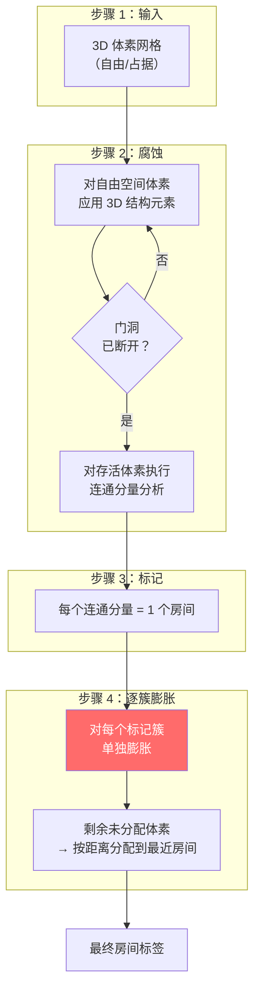
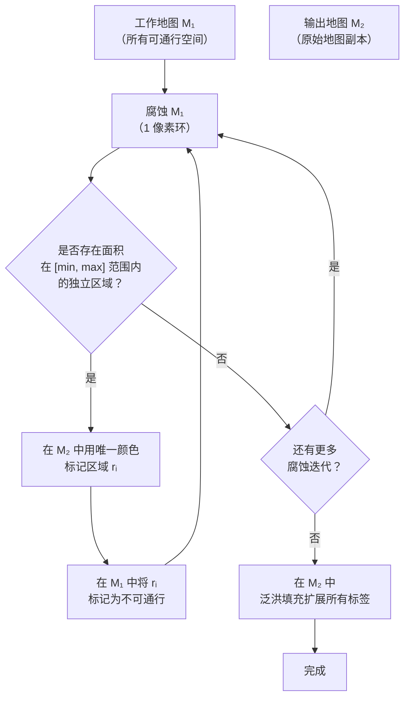

# 形态学分割

形态学分割是最简单、最直观的房间检测方法：**腐蚀自由空间直到门洞消失，将断开的区块标记为房间，再将每个区块膨胀回原始大小**。其原理在于门洞在建筑结构上比房间更窄——腐蚀操作会优先吞噬狭窄通道。

## 核心算法（3D）

> **关键洞察**：膨胀操作必须**逐簇单独执行**——而非全局膨胀。全局膨胀会通过门洞体素重新连通相邻房间。逐簇膨胀让每个房间朝自身墙壁方向扩展，而不会与邻居合并[[5]](#sources)。

## 逐步详解

### 步骤 1：提取自由空间
从体素网格中识别所有**自由（空）体素**。如果已有[开放度场](./ray-to-scalar-fields.md)，可对 Ō_min > 0 进行阈值化以获取自由体素；也可直接使用占据栅格。

### 步骤 2：3D 形态学腐蚀
将一个 3D **结构元素**（核）在自由空间体积中滑动。只有当以某体素为中心的整个结构元素都完全处于自由空间内时，该体素才能保留。

**结构元素尺寸**——成败的关键参数：

| 结构元素半径 | 效果 |
|-------------|------|
| < 门洞宽度的一半 | 门洞存活 → 房间保持连通 → **分割失败** |
| = 门洞宽度的一半 | 门洞恰好断开 → 正确分割 |
| > 门洞宽度的一半 | 可行，但小房间可能被完全腐蚀掉 |
| ≫ 房间半径 | 仅大厅存活 → **灾难性数据丢失** |

对于标准单扇门（约 0.9m 宽），球形结构元素半径取 **0.5–0.6m** 效果良好。在 5cm 体素分辨率下，对应 10–12 个体素。

### 步骤 3：连通分量标记
腐蚀完成后，对存活体素执行 3D 连通分量分析（6-连通或 26-连通）。每个连通分量即为一个独立的房间种子。

### 步骤 4：逐簇膨胀 + 分配
将每个标记簇膨胀回其原始范围：
1. 使用与腐蚀相同的结构元素尺寸
2. 对每个房间标签独立处理
3. 剩余未标记的自由体素按最近房间距离分配（Voronoi 分配）

## 2D 变体（IPA 算法）

Bormann/IPA 变体增加了一个优雅的**迭代提取**循环[[1]](#sources)：

**与 3D 版本的关键区别**：房间是渐进式提取的——小房间最先分离（需要更少的腐蚀步骤），大房间最后分离。这能更好地处理混合房间尺寸的情况，因为每个房间在其自然尺度上被提取。

**参数**：
- 腐蚀迭代次数：1 像素腐蚀的总遍数
- 房间面积下限：拒绝小于此值的区域（噪声）
- 房间面积上限：拒绝大于此值的区域（尚未完全分离）

## 优势与局限

| 方面 | 评估 |
|------|------|
| **简洁性** | ✅ 最易实现——仅需基础图像处理操作 |
| **速度** | ✅ O(N·k)，其中 N = 体素数量，k = 腐蚀迭代次数 |
| **规则布局** | ✅ 对门洞尺寸一致的标准建筑表现优秀 |
| **不规则房间** | ⚠️ L 形房间在腐蚀过于激进时可能被错误分割 |
| **混合门洞尺寸** | ❌ 单一结构元素无法同时处理窄门和宽走廊 |
| **小房间** | ❌ 针对标准门设定的腐蚀可能完全擦除小房间 |
| **参数敏感性** | ❌ 结构元素尺寸需要预先知道门洞宽度 |

## 适用场景

最佳选择条件：
- 建筑具有**一致的门洞宽度**（大多数办公室、公寓）
- 需要**最简单的实现方案**
- 布局相对**规则**（矩形房间、标准走廊）

应考虑替代方案的情况：
- 房间大小差异悬殊（储物间与宴会厅并存）
- 门洞宽度不一（窄内门 + 宽走廊入口）
- 开放式空间，边界模糊 → 参见[谱聚类](./spectral-clustering.md)

## Sources

| # | Title | Accessed |
|---|-------|----------|
| 1 | [IPA Room Segmentation Algorithms (Bormann et al.)](https://blog.csdn.net/jucat/article/details/138755341) | 2026-04-18 |
| 5 | [3D Morphological Room Segmentation (Frías et al. 2020)](https://isprs-archives.copernicus.org/articles/XLIV-4-W1-2020/49/2020/) | 2026-04-18 |
