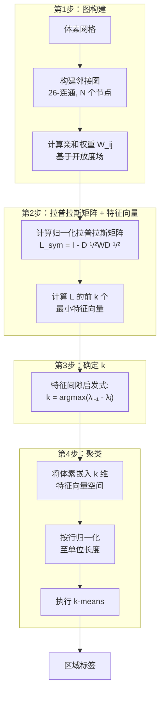
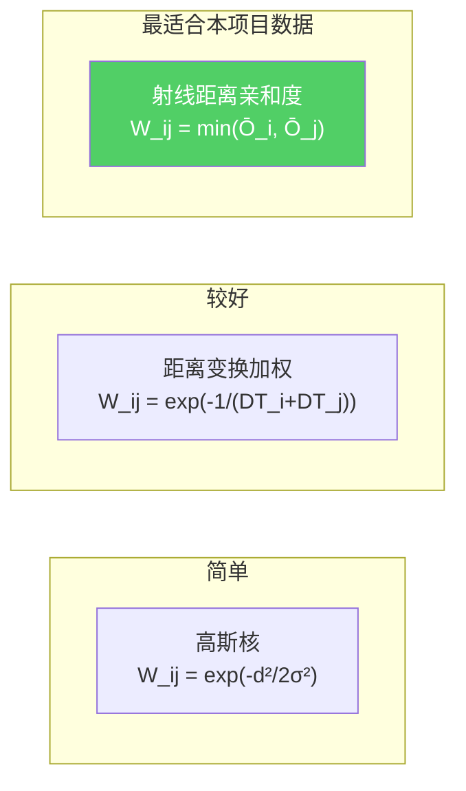
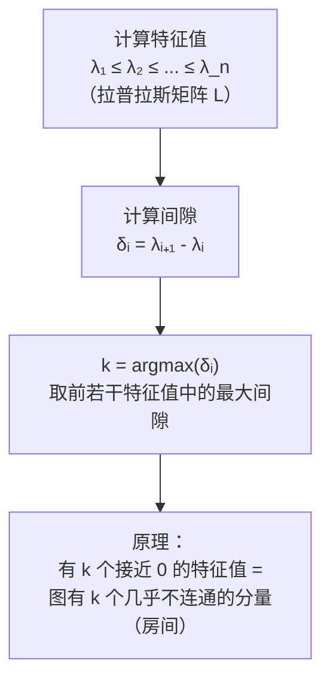
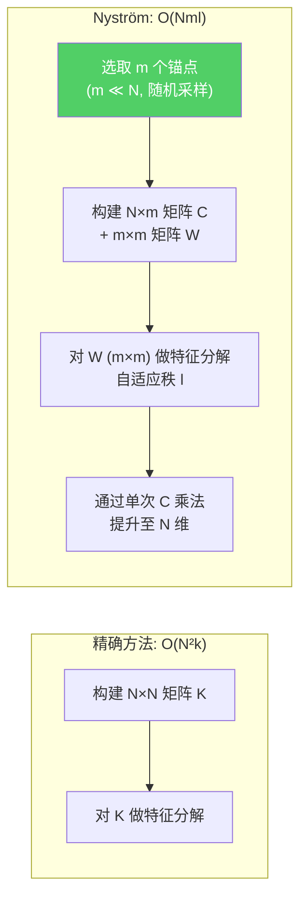

# 谱聚类用于室内空间分割

谱聚类将体素网格表示为**加权图**，通过分析图拉普拉斯矩阵的特征向量来寻找分区。核心思想：拉普拉斯矩阵的特征向量天然地编码了聚类结构——同一房间内的体素获得相似的特征向量值，而门廊处则产生剧烈的跳变。在几何启发式方法难以处理的场景下，此方法表现尤为出色：开放式空间、不规则边界以及模糊的房间划分[[11]](#sources)[[12]](#sources)。

## 完整流水线

## 亲和矩阵设计

亲和矩阵 W 是最关键的设计选择。以下五种方案按复杂度从低到高排列[[12]](#sources)：

| 方案 | 公式 | 优点 | 缺点 |
|------|------|------|------|
| 高斯核 | W_ij = exp(-d²/2σ²) | 简单 | 无法编码墙体 |
| 距离变换加权 | W_ij = exp(-1/(DT_i + DT_j)) | 墙体处值低 | 需要计算距离变换 |
| 可见性门控 | W_ij × I(visible) | 完美的墙体分离 | 每条边需要昂贵的射线检测 |
| **射线距离** | W_ij = min(Ō_i, Ō_j) | **直接使用已烘焙数据** | 需要调参 |
| 多特征融合 | exp(-α·d - β/Ō_min - γ·\|ΔŌ\|) | 表达能力最强 | 参数最多 |

**针对本项目的推荐方案**：射线距离亲和度。项目中已经有每个体素的 Ō（平均开放度）数据。min 运算确保了门廊处的体素（Ō 值低）在图中产生弱边，这正是谱聚类寻找切割点所需要的。

## 自动确定聚类数（特征间隙启发式）

房间数 k 通过特征值谱自动确定[[12]](#sources)：

对于分隔良好的房间（坚实的墙体、狭窄的门洞），特征间隙非常显著——k 个小特征值聚集在 0 附近，随后出现一个大的跳跃。对于开放式空间，间隙可能不太明显；可结合轮廓系数作为备选判据。

## 可扩展性：Nyström 近似

对于大规模体素网格（>100K 体素），精确谱聚类的计算代价过高——构建完整亲和矩阵需要 O(N²)，特征分解需要 O(N²k)。Nyström 方法可将复杂度降至近线性[[4]](#sources)：

### Nyström 算法步骤

1. 从 N 个体素中均匀采样 m 个锚点
2. **C** ∈ ℝ^(N×m)：所有 N 个体素与 m 个锚点之间的亲和度 — O(Nmd)
3. **W** ∈ ℝ^(m×m)：锚点之间的亲和度
4. 对 W 做特征分解；通过 γ 阈值确定秩 l：l = max{i : σᵢ/σ₁ ≥ γ}
5. **G** = C · U_{W,l} · Σ_{W,l}^(-1/2) — O(Nml)
6. 近似度：D̂ = diag(G · (Gᵀ · 1_N)) — 两次矩阵-向量乘积
7. G̃ = D̂^(-1/2) · G
8. 对 G̃ 做 SVD → 取前 k 个左奇异向量
9. 按行归一化，执行 k-means

### 参数建议

| 参数 | 推荐值 | 说明 |
|------|--------|------|
| m（锚点数） | 100–500 | 越多越准但越慢，必须 > k |
| γ（秩阈值） | 10⁻² | 控制精度与速度的权衡 |
| 结果 | l ≈ m 的 50–75% | 自适应确定，不强制等于 k |

**复杂度**：O(Nml)，对 C 仅需单次遍历。以 N=1M 体素、m=200、l=150 为例：约 3 亿次运算——离线处理完全可行。

## Fiedler 向量：递归二分替代方案

不同于一次计算 k 个特征向量，可以利用 **Fiedler 向量**（第 2 特征向量）进行递归二分[[11]](#sources)：

1. 仅计算拉普拉斯矩阵的第 2 特征向量
2. 按符号划分：正值 → A 组，负值 → B 组
3. 对每组递归执行，直到达到期望粒度
4. 当子图的特征间隙过小时停止（无法明确分割）

**优点**：每次分割只需一个特征向量——单次迭代更快。**缺点**：贪心策略，可能无法找到全局最优分区。

## 稀疏性优势

在 26-连通的三维体素网格上：
- 每个体素最多有 26 个邻居 → W 最多有 26N 个非零元素
- 拉普拉斯矩阵 L **极度稀疏**
- ARPACK（Lanczos 迭代）对稀疏矩阵计算前 k 个特征向量仅需 O(Nk)
- 对于适中的 k（约 20-50 个房间），即使面对百万级体素也十分高效[[12]](#sources)

## 优势与局限

| 方面 | 评估 |
|------|------|
| **开放式空间** | ✅ 比几何方法更擅长处理模糊边界 |
| **最优切割** | ✅ 最小化归一化切割——平衡且低代价的分区 |
| **自动 k** | ✅ 特征间隙启发式对分隔良好的房间效果佳 |
| **灵活性** | ✅ 亲和函数可编码任意空间特征 |
| **复杂度** | ⚠️ 精确方法: O(N²k)；Nyström: O(Nml)——仍比形态学方法重 |
| **可解释性** | ❌ 比"腐蚀后观察分离结果"更难调试 |
| **边界精度** | ⚠️ 边界可能无法与墙体精确对齐 |

## Sources

| # | Title | Accessed |
|---|-------|----------|
| 4 | [Nyström Approximation for Scalable Spectral Clustering](https://ar5iv.labs.arxiv.org/html/2006.14470) | 2026-04-18 |
| 11 | Fiedler Vector Spectral Bisection | 2026-04-18 |
| 12 | Graph Laplacian Affinity Matrix Construction | 2026-04-18 |
